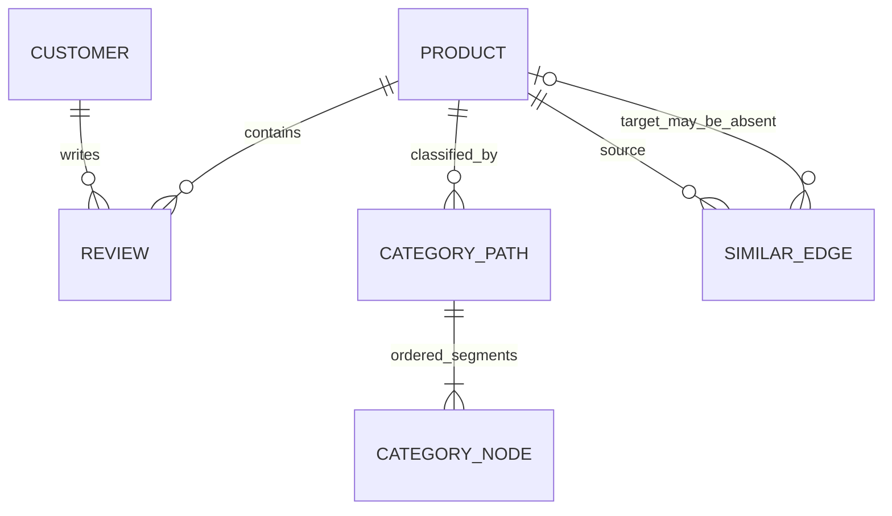

# Amazon ürün meta verisi: kalıcı veri kümesi bağlamı

## 1. Belgenin amacı

Bu belge, `Dataset/amazon-meta.txt` dosyasının gelecekteki Codex çalışmalarında güvenli ve hızlı kullanılabilmesi için oluşturulmuş, kaynakla doğrulanmış yoğun bir veri kümesi bağlamıdır. Fiziksel dosya biçimini, kayıt modelini, alanları, ilişkileri, tüm-dosya istatistiklerini, veri kalitesi sorunlarını ve ayrıştırma kurallarını özetler.

Birincil doğruluk kaynağı her zaman `Dataset/amazon-meta.txt` dosyasıdır. Bu belge ile ham veri çelişirse ham veri esas alınmalıdır. Aşağıdaki satır numaraları ve sayılar yalnızca **SHA-256 değeri bu belgede verilen dosya sürümü** için geçerlidir.

## 2. Kaynak dosya kimliği

| Özellik | Doğrulanmış değer |
|---|---:|
| Göreli yol | `Dataset/amazon-meta.txt` |
| Tam dosya adı | `amazon-meta.txt` (küçük harfli; yol büyük/küçük harfe duyarlı olabilir) |
| Boyut | `977,506,331` bayt (`977.506331` MB; `932.222682` MiB) |
| Toplam fiziksel satır | `15,010,574` |
| Boş satır | `548,553` |
| Boşluk içeren fakat boş olmayan satır | `0` |
| Ürün kaydı | `548,552` |
| Kodlama | UTF-8; `31,928` ASCII dışı bayt, `0` geçersiz UTF-8 satırı |
| Satır sonu | Yalnızca CRLF; `15,010,574` CRLF, `0` yalın LF/CR |
| SHA-256 | `600135116a05b7ce2dcb7e842e892d663c6190a0567d00373e0c5c4f3c908f02` |
| Kaynak değiştirilme zamanı | `2005-09-11T08:48:20+03:00` |
| Analiz tarihi | `2026-07-10` |
| Dosya türü | Sıkıştırılmamış, satır/blok tabanlı düz metin |

Tam bayt taramasında NUL, beklenmeyen kontrol karakteri, eksik satır sonu veya ikili veri bulunmadı. Dosya çift CRLF ile biter; son gerçek kayıt `Id: 548551`, son kayıt satırı `15,010,573`, son boş ayırıcı satır `15,010,574`'tür. Bazı kısa örnekleme araçları dosyayı ASCII olarak tanıyabilir; bu yanlıştır: tüm dosya geçerli UTF-8'dir.

## 3. Yönetici özeti

Veri kümesi Amazon ürünlerini temsil eden `548,552` ürün bloğundan oluşur. `Id` ve `ASIN` bu sürümde ayrı ayrı benzersizdir; `Id` değerleri boşluksuz `0..548551` aralığındadır. `542,684` kayıt (%98.930275) tam ürün meta verisi, `5,868` kayıt (%1.069725) yalnızca `Id`, `ASIN` ve `discontinued product` işaretinden oluşan durdurulmuş ürün kaydıdır.

Tam kayıtlar başlık, ürün grubu, satış sırası, en fazla beş benzer ASIN, kategori yolları ve yorum özeti/alt kayıtları içerir. Toplamda `2,509,699` kategori yolu, `1,788,725` benzer-ürün referansı ve `7,593,244` indirilmiş yorum satırı ayrıştırıldı.

Başlıca kullanım alanları ürün kataloğu profilleme, kategori analizi, ürün–ürün grafiği, işbirlikçi filtreleme ve yorum/puan analizidir. En kritik uyarılar şunlardır:

- Similar kenarlarının `557,286` tanesi (%31.155488) bu dosyada hedef ASIN bulamaz; grafik kapalı dünya değildir.
- `25,262` ürün kaydında birebir aynı yorum satırı tekrarları vardır; toplam `146,745` fazla oluşum ham puanları ağırlıklandırabilir.
- `8,615` üründe `reviews.total > downloaded`; indirilmeyen yorumlar nedeniyle ham alt kayıtlardan tam özet üretilemez.
- `131` üründe tersine `reviews.total < downloaded`; özet sayacı alt satırlarla çelişir.
- Tüm yorumları indirilen `533,938` kaydın `487` tanesinde saklanan ortalama, ayrıştırılmış puanların en yakın 0.5'e yuvarlanan ortalamasıyla uyuşmaz.
- `salesrank=-1` (`459` kayıt) ve `salesrank=0` (`41` kayıt) gerçek pozitif sıra gibi yorumlanmamalıdır.

## 4. Dosya biçimi ve kayıt sınırları

### Üst bilgi ve bloklar

Dosyanın ilk bloğu iki satırlık üst bilgidir:

```text
# Full information about Amazon Share the Love products
Total items: 548552
```

Bir tam boş CRLF satırı üst bilgiyi ilk üründen, sonraki her boş satır da ürün bloklarını birbirinden ayırır. Bildirilen `548552` değeri ayrıştırılan kayıt sayısıyla tam uyuşur. Son kayıt da boş satırla kapatılmıştır; yarım kayıt yoktur.

Kayıt başlangıcı `^Id:\s+<ondalık tamsayı>$`, ikinci satır `^ASIN:\s+<boşluksuz değer>$` biçimindedir. İki ve yalnızca iki kayıt şeması gözlenmiştir:

1. Normal kayıt: `Id`, `ASIN`, `title`, `group`, `salesrank`, `similar`, `categories`, kategori satırları, `reviews`, yorum satırları.
2. Durdurulmuş kayıt: `Id`, `ASIN`, iki boşluk girintili `discontinued product`.

Alan sırası dosyanın tamamında bu iki şemaya göre sabittir. Normal alanlar iki boşluk, kategori yolları üç boşluk, yorum satırları dört boşlukla girintilidir. `alan: değer` ayrımında yalnızca alan etiketinden sonraki ilk iki nokta yapısaldır; örneğin başlık içinde başka `:` karakterleri bulunabilir.

### Gerçek tam kayıt örneği

Aşağıdaki `Id: 1` bloğu kaynak satır `8–19` arasındaki eksiksiz gerçek kayıttır:

```text
Id:   1
ASIN: 0827229534
  title: Patterns of Preaching: A Sermon Sampler
  group: Book
  salesrank: 396585
  similar: 5  0804215715  156101074X  0687023955  0687074231  082721619X
  categories: 2
   |Books[283155]|Subjects[1000]|Religion & Spirituality[22]|Christianity[12290]|Clergy[12360]|Preaching[12368]
   |Books[283155]|Subjects[1000]|Religion & Spirituality[22]|Christianity[12290]|Clergy[12360]|Sermons[12370]
  reviews: total: 2  downloaded: 2  avg rating: 5
    2000-7-28  cutomer: A2JW67OY8U6HHK  rating: 5  votes:  10  helpful:   9
    2003-12-14  cutomer: A2VE83MZF98ITY  rating: 5  votes:   6  helpful:   5
```

`categories: 0`, `similar: 0` veya `downloaded: 0` durumunda ilgili alt satırlar yoktur. Çok satırlı serbest metin alanı yoktur; çok satırlılık yalnızca kategori ve yorum listelerinden kaynaklanır.

## 5. Eksiksiz alan sözlüğü

### Ürün ve liste alanları

| Gerçek etiket | Anlam ve gözlenen tür | Kardinalite / zorunluluk | Eksik değer ve ayrıştırma kuralı | Bilinen kenar durumlar |
|---|---|---|---|---|
| `Id:` | Dosya içi ürün sıra kimliği; ondalık tamsayı | Her kayıtta 1; `548,552` benzersiz | Eksik temsil gözlenmedi; etiketten sonra tamsayı | `0..548551`, boşluksuz ve tekrarsız; bu sürüm için güçlü birincil anahtar |
| `ASIN:` | Amazon ürün kimliği; metin | Her kayıtta 1; `548,552` benzersiz | Eksik temsil gözlenmedi; sayıya çevrilmemeli | Tümü `[A-Z0-9]{10}`; baştaki sıfırlar ve `X`/`B` korunmalı; similar hedef anahtarı |
| `discontinued product` | Ürünün ayrıntı alanları olmayan durdurulmuş kayıt olduğunu belirten işaret | Yalnızca `5,868` kısa kayıtta 1 | Boolean `true` olarak modellenebilir | Bu şemada diğer ürün alanlarının yokluğu hata değil, yapısal eksikliktir |
| `title:` | UTF-8 ürün başlığı; metin | Her normal kayıtta 1 | Durdurulmuş kayıtta yok/null; normal kayıtta boş değer yok | `:` ve Unicode içerebilir; karakter uzunluğu `1..451`; ilk önekten böl |
| `group:` | Ürün türü; metinsel sınıf | Her normal kayıtta 1; 10 değer | Durdurulmuş kayıtta yok/null | Baskın değerler `Book`, `Music`, `Video`, `DVD`; nadir değerler gerçektir |
| `salesrank:` | Kaynakta verilen satış sırası; işaretli tamsayı | Her normal kayıtta 1 | Ayrı null işareti yok | Aralık `-1..3,798,351`; `-1` ve `0` sentinel/özel değer olarak korunup ayrıca işaretlenmeli |
| `similar:` | Bildirilen sayı ve ardından boşlukla ayrılmış ASIN listesi | Her normal kayıtta 1; gerçek uzunluk `0..5` | `similar: 0` boş listedir | Bildirilen sayı tüm `542,684` kayıtta gerçek token sayısıyla uyuşur; hedef ASIN dosyada bulunmayabilir |
| `categories:` | Ardından gelen kategori yolu satırı sayısı | Her normal kayıtta 1; gerçek uzunluk `0..116` | `categories: 0` boş listedir | Bildirilen sayı tüm kayıtlarda gerçek satır sayısıyla uyuşur |
| `reviews:` | `total`, `downloaded`, `avg rating` içeren yorum özeti | Her normal kayıtta 1 | Sıfır yorum `total: 0 downloaded: 0 avg rating: 0` biçimindedir | `total` ile `downloaded` her zaman eşit değildir; ortalama yalnızca tam indirmede yeniden doğrulanabilir |

### Kategori yolu alt yapısı

Her kategori satırı üç boşluk ardından `|` ile başlar. Mantıksal biçim tekrarlanan `|etiket[sayısal_düğüm_id]` segmentleridir.

| Alt alan | Tür | Kural ve istisna |
|---|---|---|
| `category_path` | Sıralı segment listesi | Bir ürün çok sayıda yola sahip olabilir; aynı yol çok üründe görülebilir |
| `category_label` | UTF-8 metin | Boş olabilir: `|[139452]`. `Williams, John        [guitar]` gibi köşeli parantezli metin de olabilir |
| `category_node_id` | Ondalık tamsayı | Segmentin **sonundaki** `[sayısal id]`; etiketteki ilk `[` üzerinden bölmek hatalıdır |
| Yol derinliği | Tamsayı | Gözlenen `2..11`; medyan `5` |

Bu sürümde `49,732` farklı kategori düğüm kimliği ve `26,059` farklı etiket vardır. Aynı düğüm kimliğinin birden fazla etikete bağlandığı bir örnek saptanmadı. `39` yol oluşumunda etiketin kendisi `[guitar]` içerir; bunlar bozuk satır değil biçim varyantıdır.

### Yorum alt kaydı

Kaynak etiketi gerçekten `cutomer:` şeklinde hatalı yazılmıştır; ayrıştırıcı bunu literal olarak kabul etmelidir.

| Alt alan | Gözlenen tür | Zorunluluk / biçim | Doğrulama sonucu |
|---|---|---|---|
| Tarih | Takvim tarihi | `YYYY-M-D`; ay/gün sıfır dolgulu olmak zorunda değil | `7,593,244` satırın tümü geçerli tarih; aralık `1970-12-30..2005-07-09` |
| `cutomer` | Müşteri kimliği; metin | Boşluksuz `[A-Z0-9]+`, uzunluk `9..14` | `1,555,170` farklı değer; biçim dışı değer yok |
| `rating` | Tamsayı | `1..5` | Aralık dışı değer yok |
| `votes` | Tamsayı | `>=0` | Negatif değer yok; maksimum `7,669` |
| `helpful` | Tamsayı | `0 <= helpful <= votes` | İhlal yok; maksimum `7,453` |

Yorum satırı, `(ASIN, tarih, cutomer)` bakımından benzersiz değildir. Aynı müşteri aynı gün aynı üründe birden fazla yorum satırına sahip olabilir; bazen satırlar birebir aynıdır.

### Bilinmeyen alanlar

Tam dosya taramasında yukarıdaki şemaların dışında alan etiketi, ayrıştırılamayan üst düzey satır veya farklı yazılmış yorum alanı bulunmadı.

## 6. Mantıksal veri modeli ve ilişkiler



- **Product:** Temel kayıt birimidir. `Id` dosya içi benzersiz anahtar, `ASIN` hem benzersiz ürün anahtarı hem ilişki hedefidir.
- **Review:** Ürüne bire-çok bağlı alt kayıttır. Müşteri kimliği dosyada ayrı bir ana varlık olarak tanımlanmaz; yorumlardan türetilir. Müşteri–ürün ilişkisi çoktan çoğadır.
- **Similar edge:** Yönlü `source ASIN -> referenced ASIN` kenarıdır. Dosyada karşılıklı/simetrik olacağı varsayılmamalıdır. Hedef düğümün veri kümesinde bulunması garanti değildir.
- **Category path:** Ürün ile sıralı kategori düğümleri arasında çoktan çoğa sınıflandırmadır. Aynı düğüm/yol birçok üründe tekrarlanabilir; bir ürün birçok yola sahiptir.
- **Discontinued product:** Aynı Product kimliğini taşır, fakat başlık, grup, sıralama, kategori, similar ve yorum alanları yoktur.

## 7. Temel istatistikler

### Kayıtlar, anahtarlar ve kapsama

| Metrik | Değer |
|---|---:|
| Toplam kayıt | `548,552` |
| Normal kayıt | `542,684` (%98.930275) |
| Durdurulmuş kayıt | `5,868` (%1.069725) |
| Geçerli ayrıştırılan kayıt | `548,552` |
| Eksik / yarım / bozuk kayıt | `0 / 0 / 0` |
| Farklı `Id` / farklı `ASIN` | `548,552 / 548,552` |
| Yinelenen `Id` / `ASIN` / tam kayıt bloğu | `0 / 0 / 0` |
| Eksik ID (`0..548551` içinde) | `0` |

`Id` ve `ASIN` tüm kayıtların %100'ünde bulunur. Diğer normal alanların her biri uygulanabilir `542,684` kaydın %100'ünde; `discontinued product` işareti uygulanabilir `5,868` kaydın %100'ünde bulunur. Normal başlık/grup alanlarında boş metin yoktur.

| Alan | Mevcut | Eksik (uygulanabilir şemada) | Farklı değer / sayı |
|---|---:|---:|---:|
| `Id` | 548,552 | 0 | 548,552 |
| `ASIN` | 548,552 | 0 | 548,552 |
| `title` | 542,684 | 0 | 499,813 |
| `group` | 542,684 | 0 | 10 |
| `salesrank` | 542,684 | 0 | 411,707 |
| `similar` bildirilen uzunluğu | 542,684 | 0 | 6 (`0..5`) |
| `categories` bildirilen uzunluğu | 542,684 | 0 | 90 farklı uzunluk |
| `reviews.total` | 542,684 | 0 | 958 farklı değer |

### Ürün grupları

| Grup | Kayıt | Normal kayıt payı |
|---|---:|---:|
| Book | 393,561 | %72.521209 |
| Music | 103,144 | %19.006273 |
| Video | 26,131 | %4.815141 |
| DVD | 19,828 | %3.653692 |
| Toy | 8 | %0.001474 |
| Software | 5 | %0.000921 |
| CE | 4 | %0.000737 |
| Baby Product | 1 | %0.000184 |
| Sports | 1 | %0.000184 |
| Video Games | 1 | %0.000184 |

### Sayısal ve uzunluk dağılımları

Yüzdelikler tam veri üzerinde nearest-rank yöntemiyle hesaplanmıştır; medyan klasik orta değer medyanıdır.

| Metrik | n | min | p25 | medyan | ortalama | p75 | p95 | p99 | maks | sıfır | negatif |
|---|---:|---:|---:|---:|---:|---:|---:|---:|---:|---:|---:|
| `salesrank` | 542,684 | -1 | 90,741 | 300,490 | 489,324.293 | 672,068 | 1,617,858 | 2,860,489 | 3,798,351 | 41 | 459 |
| Başlık karakter uzunluğu | 542,684 | 1 | 21 | 38 | 44.331 | 60 | 101 | 139 | 451 | 0 | 0 |
| Similar elemanı | 542,684 | 0 | 0 | 5 | 3.296 | 5 | 5 | 5 | 5 | 163,591 | 0 |
| Kategori yolu | 542,684 | 0 | 2 | 4 | 4.625 | 6 | 13 | 24 | 116 | 22,903 | 0 |
| `reviews.total` | 542,684 | 0 | 0 | 2 | 14.340 | 8 | 50 | 223 | 5,545 | 139,949 | 0 |
| `reviews.downloaded` | 542,684 | 0 | 0 | 2 | 13.992 | 7 | 49 | 219 | 4,995 | 139,960 | 0 |
| Kayıt satırı | 548,552 | 3 | 12 | 15 | 26.364 | 21 | 65 | 234 | 5,014 | 0 | 0 |
| Kayıt baytı | 548,552 | 51 | 585 | 884 | 1,779.976 | 1,464 | 4,891 | 17,847 | 386,264 | 0 | 0 |

Kayıt baytı, boş ayırıcı satır hariç blok içi satırları ve CRLF sonlarını kapsar. Tukey 1.5×IQR ile işaretlenen yüksek değerler yalnızca betimsel aykırıdır; özellikle çok yorumlu ürünler gerçek büyük kayıtlardır. En büyük blok `Id: 428073`, satır `11,415,689`, `5,014` satır ve `386,264` bayttır; `4,995` indirilmiş yorum içerir. En küçük blok `Id: 0`, satır `4`, üç satır ve 51 baytlık durdurulmuş üründür. En uzun başlık `Id: 255607`, satır `6,925,559`, 451 karakterdir.

### Kategoriler

- Toplam yol oluşumu: `2,509,699`; farklı tam yol: `46,215`.
- Farklı düğüm kimliği: `49,732`; farklı etiket: `26,059`.
- Yol derinliği: min `2`, medyan `5`, ortalama `5.464789`, p95 `7`, p99 `9`, maks `11`.
- En sık kökler: `Books[283155]` (`1,287,060`), `Music[5174]` (`472,193`), boş etiketli `[139452]` (`457,229`), boş etiketli `[265523]` (`262,242`).
- En sık tam yollar: Amazon Stores/Business & Investing/General (`18,439`) ve Books/Business & Investing/General (`18,437`).
- `22,903` üründe kategori listesi boş; `27,801` ürünün kategori sayısı IQR üst sınırı 12'nin üzerindedir. Bu son grup otomatik olarak bozuk kabul edilmemelidir.

### Yorumlar

| Metrik | Değer |
|---|---:|
| `reviews.total` toplamı | 7,781,990 |
| `reviews.downloaded` toplamı / ayrıştırılan satır | 7,593,244 / 7,593,244 |
| Farklı müşteri | 1,555,170 |
| Farklı tarih metni | 3,521 |
| Tarih aralığı | 1970-12-30 – 2005-07-09 |
| Tarih sırası artan kayıt | 321,690 |
| Tarih sırası azalan kayıt | 24 |
| Sıra uygulanamayan (0/1 yorum) | 220,970 |

Yorum satırları her zaman artan tarihte değildir. Özellikle son bölümde azalan sıralı örnekler vardır; ayrıştırıcı kaynak sırasını korumalı, analiz gerekiyorsa açıkça sıralamalıdır.

| Rating | Satır | Pay |
|---:|---:|---:|
| 5 | 4,564,259 | %60.109474 |
| 4 | 1,401,990 | %18.463650 |
| 3 | 627,917 | %8.269417 |
| 2 | 415,312 | %5.469494 |
| 1 | 583,766 | %7.687966 |

Ortalama bireysel rating `4.178372`, medyan `5`'tir. `votes` için min/medyan/ortalama/p95/p99/maks `0 / 2 / 5.859097 / 22 / 52 / 7,669`; `helpful` için `0 / 1 / 3.794829 / 15 / 36 / 7,453`'tür. Oyların `1,736,373`, helpful değerlerinin `2,479,525` tanesi sıfırdır.

## 8. Veri kalitesi ve anomaliler

### Çapraz alan kontrolleri

| Kontrol | Geçen | Başarısız | Sonuç / kesinlik |
|---|---:|---:|---|
| Üst bilgi `Total items` = gerçek kayıt | 1 | 0 | Kesin |
| ID benzersiz, sıralı ve boşluksuz | 548,552 | 0 | Kesin |
| ASIN benzersiz ve `[A-Z0-9]{10}` | 548,552 | 0 | Kesin |
| Kayıt şeması, alan sırası ve zorunlu alanlar | 548,552 | 0 | Kesin |
| Similar bildirilen sayı = token sayısı | 542,684 | 0 | Kesin |
| Kategori bildirilen sayı = yol satırı | 542,684 | 0 | Kesin |
| Downloaded = ayrıştırılan yorum satırı | 542,684 | 0 | Kesin |
| `reviews.total >= downloaded` | 542,553 | 131 | Kesin |
| Tam indirilen kayıtta ortalama = puan ortalamasının en yakın 0.5'i | 533,451 | 487 | Kesin; 8,746 eşitsiz total/downloaded kaydında uygulanamaz |
| Similar hedef oluşumu veri kümesinde mevcut | 1,231,439 | 557,286 | Kesin oluşum sayısı |
| Rating `1..5` | 7,593,244 | 0 | Kesin |
| `0 <= helpful <= votes` | 7,593,244 | 0 | Kesin |
| Geçerli takvim tarihi | 7,593,244 | 0 | Kesin; tarihsel anlamlılık ayrı konu |
| Kategori düğüm ID–etiket eşleşmesi | 49,732 farklı ID | 0 çatışma | Kesin |

### Önemli bulgular

| Önem | Anomali | Etki ve örnek | Güvenli ele alma |
|---|---|---|---|
| Yüksek | Yetim similar referansları | `557,286` oluşum, `172,790` farklı hedef ASIN; oluşumların %31.155488'i. Örnek: `Id 1438`, satır `43,521`, hedef `B00023P4I8` | Grafikte dış/dangling düğüm olarak koru veya filtrelemeyi açıkça raporla; bunun snapshot kapsamından mı bozulmadan mı kaynaklandığı dosyadan kanıtlanamaz |
| Yüksek | Birebir tekrarlı yorumlar | `25,262` ürün (%4.655011), `146,745` fazla satır (%1.932573). `Id 21` bloğunda aynı `2005-4-9` satırı iki kez | Modelleme öncesi ham ve tekilleştirilmiş sonuçları karşılaştır; varsayılan anahtar kararını belgeleyip ham satırı sakla |
| Orta | Aynı müşteri–tarih tekrarları | `64,204` ürün (%11.830826), `319,069` fazla oluşum; birebir tekrarları da kapsar | `(ASIN, customer, date)` benzersiz kabul edilmemeli; aynı gün farklı rating/vote satırları olabilir |
| Orta | `total < downloaded` | `131` ürün (%0.024139). `Id 57118`, satır `1,561,347`: total 2, downloaded 5 | Alt satır sayısını fiziksel gerçek, header total'ı ayrı ham alan olarak tut; sessizce birini ezme |
| Orta | Ortalama puan uyuşmazlığı | Tam indirilen `533,938` ürünün `487` tanesi (%0.091209). `Id 824`, satır `26,341`: saklanan 4.5, hesaplanan 4.223881, en yakın yarım 4.0 | Türetilmiş ortalama gerekiyorsa alt puanlardan yeniden hesapla ve kaynak ortalamayı ayrı tut |
| Orta | Kısmi yorum indirme | `8,615` üründe total > downloaded (%1.587480). `Id 336985`, satır `9,060,838`: total 593, downloaded 0, avg 4.5 | Downloaded alt kümesinden total-popülasyon ortalaması çıkarmaya çalışma; eksikliği seçim yanlılığı olarak belirt |
| Düşük/olası | 1970 tarihleri | Tam iki satır; `Id 96655` satır `2,646,681` ve `Id 516574` satır `13,695,307`, aynı müşteri `AE22YDHSBFYIP`. Sonraki yıl 1995 | Takvimce geçerli fakat dağılımda izole; olası taşınmış/sentinel veri olarak işaretle, kanıt olmadan silme |
| Düşük | Salesrank sentinel değerleri | `-1`: 459 kayıt (%0.084580); `0`: 41 kayıt (%0.007555). Örnek `Id 693`, satır `23,636` | Pozitif sıra analizinde null/özel sınıf olarak ele al; ham değeri koru |
| Biçim varyantı | Etikette köşeli parantez | `Williams, John        [guitar]` etiketi 39 yol oluşumunda; örnek `Id 4239`, satır `120,018` | Segmenti son `[sayısal id]` üzerinden ayır; bunu bozuk kategori sayma |
| Beklenen uç değer | Çok büyük kayıtlar | Maksimum 5,014 satır/386,264 bayt; `Id 428073` | Satır veya kayıt uzunluğuna düşük sabit limit koyma; akış/blok yaklaşımı kullan |

NUL, geçersiz UTF-8, beklenmeyen kontrol karakteri, NaN/sonsuz sayı, negatif oy/helpful, rating aralık ihlali, `helpful > votes`, hatalı tarih, bozuk kayıt sonu, bilinmeyen alan, sayım uyuşmazlığı olan similar/kategori/downloaded listesi, yinelenen ürün anahtarı veya yarım kayıt bulunmadı.

## 9. Ayrıştırma rehberi

1. Dosyayı UTF-8 ve `newline=""`/ikili modda akış tabanlı aç; CRLF'yi doğrula fakat platformun satır sonu dönüşümüne güvenme.
2. İlk boş satıra kadar olan iki satırı üst bilgi olarak ayrıştır ve `Total items` değerini son kayıt sayısıyla kontrol et.
3. Sonraki boş satırları kayıt sonlandırıcısı kabul et. EOF'ta açık blok varsa ayrı hata olarak raporla; bu sürümde yoktur.
4. Her blokta önce `Id`, sonra `ASIN` ara. Üçüncü satır `  discontinued product` ise kısa şemayı kullan ve başka alan bekleme.
5. Normal şemada literal önekleri ve girintiyi koru. `title:` değerini yalnızca ilk yapısal önekten ayır; başlığın içindeki iki noktaları bölme.
6. `similar:` satırında ilk tamsayı bildirilen uzunluktur, kalan boşlukla ayrılmış değerler ASIN'dir. Sayıyı gerçek token sayısıyla karşılaştır.
7. `categories:` sonrasında bildirilen sayıda üç boşluk + `|` satırı oku. Yolu `|` segmentlerine böl; her segmenti açgözlü biçimde **son** `[işaretli tamsayı]` soneki üzerinden `(label, node_id)` olarak ayrıştır. Boş label geçerlidir.
8. `reviews:` satırını `total`, `downloaded`, `avg rating` olarak ayrıştır. Ardından yalnızca dört boşlukla başlayan yorum satırlarını oku. Kaynaktaki yanlış yazım `cutomer:` kabul edilmelidir.
9. Tarihi takvim tarihi olarak doğrula; `YYYY-M-D` için değişken ay/gün genişliğine izin ver. Yorumların tarih sırasını varsayma.
10. Her kayıt için bildirilen ve gerçek liste uzunluklarını, zorunlu alanları, alan tekrarlarını, bilinmeyen satırları ve başlangıç/bitiş satır numaralarını raporla.
11. Hatalı bir alt satırı sessizce atlama. Ürün kimliği, ham satır, satır numarası ve hata sınıfını sakla; mümkünse kaydın kalanını ayrıştırmaya devam et.
12. UTF-8 başlık, kategori etiketi ve orijinal yorum satırını denetim için koru. Normalizasyonu ayrı türetilmiş kolonlarda yap.

Kaçınılması gereken yaklaşımlar: dosyanın tamamını tek stringe yüklemek; yalnızca `Id:` satırlarına güvenip boş blok sınırlarını yok saymak; kategori etiketini ilk `[` karakterinden bölmek; ASIN'i sayıya çevirmek; `total` kadar yorum satırı zorlamak; yorumları `(customer,date)` ile otomatik tekilleştirmek; `salesrank <= 0` değerlerini habersizce silmek.

Tekrarlanabilir profil aracı:

```bash
python3 scripts/analyze_amazon_meta.py --self-test
python3 scripts/analyze_amazon_meta.py Dataset/amazon-meta.txt --output /tmp/amazon-meta-analysis.json
```

## 10. Önerilen veri türleri ve dönüştürme kararları

| Mantıksal alan | Önerilen hedef tür | Nullable | Karar |
|---|---|---:|---|
| `id` | 64-bit tamsayı | Hayır | Dosya sürümüne bağlı satır anahtarı |
| `asin` | String | Hayır | Sayısal değildir; baştaki sıfır ve harfleri korur |
| `is_discontinued` | Boolean | Hayır | Kısa şemadan türetilir |
| `title`, `group` | UTF-8 string | Evet | Yalnızca discontinued kayıtlarda null; boş string ile null'ı karıştırma |
| `salesrank_raw` | İşaretli 64-bit tamsayı | Evet | Ham `-1` ve `0` korunur; analiz için ayrı `salesrank_valid` nullable pozitif alanı üretilebilir |
| `similar_asins` | Sıralı `array<string>` | Hayır | Boş liste kullanılmalı; hedef varlığı ayrı boolean ile tutulabilir |
| `category_paths` | `array<array<struct<label:string,node_id:int64>>>` | Hayır | Yol ve segment sırası korunmalı; label boş olabilir |
| `reviews_total`, `reviews_downloaded` | 64-bit tamsayı | Evet | Header değerleri ayrı tutulmalı; birbiriyle çelişebilir |
| `avg_rating_raw` | Decimal(2,1) veya kayıpsız kısa decimal | Evet | Kaynak değeri; yeniden hesaplanan ortalamayla ezilmemeli |
| `review.date` | Yerel takvim tarihi | Hayır | Saat dilimi yok; timestamp uydurulmamalı |
| `review.customer` | String | Hayır | Sayıya çevrilmemeli |
| `review.rating` | 8-bit tamsayı | Hayır | Gözlenen 1–5 |
| `review.votes`, `review.helpful` | 64-bit tamsayı | Hayır | Bu dosyada int32'ye sığar; taşınabilirlik için int64 güvenlidir |
| Kaynak konumu | 64-bit satır numarası / bayt ofseti | Önerilir | Yeniden üretim ve anomali denetimi için |

Liste sıraları ve ham metin korunmalıdır. Başlık trim/case-fold, kategori label normalizasyonu veya yorum tekilleştirme yapılacaksa ham değerin yanında yeni alan üretilmelidir.

## 11. Güvenli kullanım notları

- Bu belgedeki sayımlar, oranlar, dağılımlar, farklı değer sayıları ve çapraz kontroller dosyanın tamamı üzerinden **kesin** hesaplanmıştır; kayıt örnekleri ve manuel incelemeler deterministik seçilmiş örneklerdir.
- Yüzdelikler exact nearest-rank, medyan exact, IQR aykırı bayrakları Tukey 1.5×IQR yöntemidir. IQR bayrağı veri bozulması kanıtı değildir.
- `Id` ve `ASIN` bu sürümde benzersizdir. Dış sistemlerde kalıcı ürün anahtarı olarak `ASIN`; yalnızca bu dosya sürümünde satır anahtarı olarak `Id` daha uygundur.
- Similar grafiğinde hedef kapsaması eksiktir. Hedefi bulunmayan kenarları atmak grafiğin derece ve bağlantılılık dağılımını değiştirir.
- İşbirlikçi filtreleme öncesinde birebir tekrarlı yorumların ve aynı gün tekrarlanan müşteri–ürün etkileşimlerinin etkisi ölçülmelidir. Kaynak sırasına göre “son yorum” seçmek güvenli değildir.
- `reviews.total`, indirilmiş alt kayıt sayısı değildir. `downloaded` fiziksel satır sayısıyla uyuşur; `total` kaynakta bildirilen daha geniş sayımdır ve 131 kayıtta ters yönde tutarsızdır.
- Kaynak `avg rating`, her zaman indirilen yorumlardan yeniden üretilemez ve 487 tam kayıtta bile uyuşmaz. Analizin hangi ortalamayı kullandığı açıkça yazılmalıdır.
- 1970 tarihleri takvimce geçerli fakat olası veri anomalileridir. Zaman analizi yaparken ayrıca işaretlenmelidir.
- Satır numaraları dosya sürümü değişince geçersizleşir; önce SHA-256 kontrol edilmelidir.

## 12. Gelecekteki Codex ajanı için hızlı başvuru

- **Temel kayıt:** Bir Amazon ürünü; `548,552` blok.
- **Başlangıç/bitiş:** `Id:` ile başlar, boş CRLF satırında biter; dosyanın sonunda da boş satır vardır.
- **Birincil kimlikler:** `Id` ve `ASIN` bu sürümde benzersiz; ilişkiler ASIN kullanır.
- **İki şema:** `542,684` normal + `5,868` `discontinued product` kısa kaydı.
- **Alan sırası:** Normalde `Id, ASIN, title, group, salesrank, similar, categories, reviews`; tüm dosyada sabit.
- **Alt yapılar:** Similar ASIN listesi; sıralı kategori yolları; `cutomer` yazımlı yorum satırları.
- **Önemli hacim:** 15,010,574 satır; 2,509,699 kategori yolu; 1,788,725 similar kenarı; 7,593,244 yorum.
- **En kritik sorunlar:** %31.155488 yetim similar kenarı; 146,745 fazla birebir yorum satırı; 8,615 kısmi yorum özeti; 131 ters sayım; 487 ortalama uyuşmazlığı.
- **Sentineller:** `salesrank=-1` ve `0`; pozitif sıralamayla birleştirme.
- **Kategori ayrıştırma:** Segmentte son `[sayısal id]` sonekini kullan; label boş veya `[guitar]` içerebilir.
- **Yorum ayrıştırma:** `downloaded` kadar fiziksel satır; `total` farklı olabilir. Tarih sırası güvenilir değildir.
- **Güvenli yaklaşım:** UTF-8 ikili/akış okuma, boş satır blokları, literal girinti/etiketler, bildirilen-gerçek sayım kontrolleri, ham metin ve kaynak konumu koruma.
- **Ham veriyi yeniden incele:** Kesin kayıt içeriği, yeni ayrıştırma kuralı, nadir grup/kenar durum, kritik modelleme kararı, farklı dosya sürümü veya hash uyuşmazlığı varsa.

## 13. Analiz yöntemi ve doğrulama kapsamı

Analiz `scripts/analyze_amazon_meta.py` ile Python 3.12 standart kütüphanesi kullanılarak yapıldı. Araç dosyayı ikili modda satır satır okur; aynı geçişte SHA-256, satır sonları, encoding, blok sınırları, alan/alt kayıt şeması, tam sayımlar, farklı değerler, dağılımlar, anahtarlar, referans kapsamı ve anomali örneklerini üretir. Kaynak dosyanın tamamı belleğe yüklenmez; yalnızca tek kayıt bloğu ve toplulaştırılmış sayaçlar tutulur.

Gerçekleştirilen doğrulamalar:

- İlk keşif geçişi, UTF-8/kategori etiketi düzeltmesinden sonraki geçiş, nihai metrik geçişi ve deterministik son doğrulama dahil dört tam ayrıştırıcı geçişi.
- ASCII dışı baytların ve UTF-8 geçerliliğinin ayrı tam-dosya taraması.
- Seçili ham blokları bulmak için ek akış taraması; başlangıç (`Id 0–2`), orta (`Id 276433`), yaklaşık %75 (`Id 424590`) ve son (`Id 548549–548551`) kayıtlar doğrudan okundu.
- Ortalama uyuşmazlığı (`Id 824`), tekrarlı yorum (`Id 21`), ters total/downloaded (`Id 57118`), yetim referans (`Id 1438`), parantezli kategori (`Id 4239`), 1970 tarihli kayıtlar (`Id 96655`, `516574`), negatif rank (`Id 693`), en uzun başlık (`Id 255607`) ve en büyük blok (`Id 428073`) doğrudan incelendi.
- Başlangıç/son baytlar, bağımsız `stat`, `wc` ve `sha256sum` sonuçlarıyla fiziksel toplamların son kez karşılaştırılması.
- Nihai JSON metriklerinin iki çalıştırma arasında deterministik karşılaştırılması ve Markdown'daki temel sayıların makine çıktısına karşı denetlenmesi.

Yaklaşık kayıt veya örneklem tabanlı istatistik yoktur. Top-k örnek listeleri sınırlıdır; ana sayımlar kesindir. Harici Amazon kataloğu kullanılmadığı için ASIN'lerin gerçek ürün anlamı, yetim referansların nedeni, 1970 tarihlerinin kök nedeni ve kaynak ortalama uyuşmazlıklarının üretim süreci doğrulanamamıştır.

## 14. Sınırlamalar ve yeniden analiz koşulları

`dataset-description.md`, hızlı bağlam ve genel kararlar için kullanılabilir; ancak bir özellik burada bulunmuyorsa, belge yetersiz kalıyorsa, kesin satır veya kayıt doğrulaması gerekiyorsa, veri dosyası değişmişse, dosyanın parmak izi uyuşmuyorsa ya da kritik bir karar verilecekse `Dataset/amazon-meta.txt` doğrudan yeniden incelenmelidir.

Özellikle şu durumlarda ham dosyaya başvurulmalıdır:

- Kesin kayıt içeriği veya tam ham metin gerekiyorsa.
- Nadir bir kenar durum araştırılıyorsa.
- Yeni bir ayrıştırma/normalizasyon/tekilleştirme kuralı geliştiriliyorsa.
- İstatistik yeniden üretilmek veya farklı yöntemle hesaplanmak isteniyorsa.
- Bu açıklama ile gözlenen davranış çelişiyorsa.
- Veri kümesinin farklı bir sürümü kullanılıyorsa veya SHA-256 uyuşmuyorsa.
- Similar kenarlarını filtreleme, yorumları tekilleştirme ya da sentinelleri null'a çevirme gibi geri döndürülemez bir karar verilecekse.

Bu belge kaynak dosyanın kendisinin yerine geçen normatif bir şema değildir; doğrulanmış sürüm bağlamıdır.
