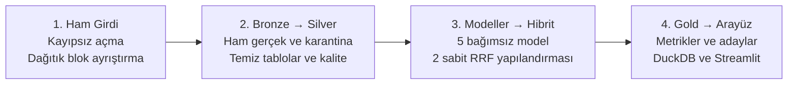

**CODEX UYGULAMA ŞARTNAMESİ**

**Big Data Project
Implementation Details**

Amazon Ürün Meta Verisi Üzerinde Spark Tabanlı Hibrit Öneri Sistemi

> Bu belge, Codex’in projeyi ham veri alımından dört sayfalı arayüze kadar baştan sona uygulayabilmesi için hazırlanmış bağlayıcı teori ve kabul sözleşmesidir.
>
> **Karar ilkesi:** matematik ve veri anlamı sabit; kod tasarımı ve iç mimari Codex’in uzmanlık alanıdır.

**Sürüm 1.0 • 11 Temmuz 2026 • Uygulama kapsamı: P0**

# İçindekiler ve Hızlı Erişim

Başlıklara gitmek için aşağıdaki statik iç bağlantıları kullanın.

- [1. Codex İçin Bağlayıcı Çalışma Sözleşmesi](#section-01)
- [2. Proje Özeti, Amaç ve Bitti Tanımı](#section-02)
- [3. Kanonik Veri Kümesi ve Sayım Sözleşmeleri](#section-03)
- [4. Uçtan Uca Mimari ve Teknoloji Sınırları](#section-04)
- [5. Ortam Keşfi, Sürüm Kilidi ve Spark Sabitleri](#section-05)
- [6. Dağıtık Ham Veri Alımı ve Ayrıştırıcı Sözleşmesi](#section-06)
- [7. Mantıksal Veri Modeli](#section-07)
- [8. Temizleme, Tekilleştirme ve Veri Kalitesi](#section-08)
- [9. Zamansal Bölme ve Modelleme Kohortları](#section-09)
- [10. Model 1 — Bayesçi Popülerlik](#section-10)
- [11. Model 2 — Açık Geri Bildirimli ALS](#section-11)
- [12. Model 3 — FP-Growth Birliktelik Önericisi](#section-12)
- [13. Model 4 — Graf Analizi ve Graf Önericisi](#section-13)
- [14. Model 5 — Kategori Tabanlı İçerik Önericisi](#section-14)
- [15. Gerçek Hibrit Sistem — Yalnızca H-A ve H-B](#section-15)
- [16. Minimum Deney Matrisi ve Değerlendirme](#section-16)
- [17. Tek Spark Performans Deneyi](#section-17)
- [18. Dört Sayfalı Streamlit Arayüzü](#section-18)
- [19. Test Stratejisi ve Matematik Doğrulaması](#section-19)
- [20. Faz Geçitleri ve Codex Uygulama Sırası](#section-20)
- [21. Tekrar Üretilebilirlik ve Koşum Manifestosu](#section-21)
- [22. Son Teslim Paketi ve Kabul Kontrolü](#section-22)
- [Ek A — Değiştirilemez Sabitler Özeti](#appendix-a)
- [Ek B — Resmî Teknik Başvurular](#appendix-b)
- [Ek C — Codex’e Verilecek Kısa Başlatma Mesajı](#appendix-c)

<a id="section-01"></a>

# 1. Codex İçin Bağlayıcı Çalışma Sözleşmesi

**Başlangıç direktifi:** Bu doküman projenin gereksinim ve teori sözleşmesidir; satır satır kod tarifi değildir. Verilen formülleri, eşikleri, veri bölme kurallarını, model parametrelerini ve kabul ölçütlerini aynen uygula. Kod mimarisini profesyonel, test edilebilir ve sürdürülebilir olacak biçimde kendin tasarla. Küçük deterministik veri bütün geçitlerden geçmeden tam veri koşusunu başlatma. Çalıştırmadığın sonucu üretme veya uydurma. Bir aşamanın kabul ölçütü sağlanmıyorsa sonraki aşamaya geçme.

Codex bu belgeyi aldıktan sonra önce mevcut çalışma alanını, veri dosyasını, donanımı ve kurulu yazılımı inceler; ardından faz geçitlerine bağlı bir uygulama planı oluşturur. Belgede verilmiş bir matematik kararını yeniden kullanıcıya sormaz. Yalnızca veri yolunun bulunamaması, yazma izni olmaması veya gerekli bağımlılığın kurulmasının mümkün olmaması gibi gerçek bir engelde açıklama ister.

## 1.1 Karar seviyeleri

| **Seviye** | **Anlam**                                                                                               | **Örnekler**                                                                                                              |
|------------|---------------------------------------------------------------------------------------------------------|---------------------------------------------------------------------------------------------------------------------------|
| ZORUNLU    | Değiştirilemez; birebir uygulanır.                                                                      | Formüller, eşikler, veri temizleme sırası, model parametreleri, iki hibrit ağırlık kümesi, metrikler ve veri sözleşmeleri |
| SERBEST    | Codex profesyonel mühendislik kararı verir.                                                             | Dosya ve sınıf adları, fonksiyon sınırları, modül içi tasarım, eşdeğer Spark SQL planları, arayüz bileşenleşmesi          |
| KOŞULLU    | Teknik zorunluluk varsa eşdeğer çözüm seçilebilir; anlam değişmez ve sapma koşum manifestosuna yazılır. | Spark–Scala–GraphFrames uyumluluğu, bellek sınırı, işletim sistemi farkı, özel ayırıcı uyumsuzluğu                        |

**Yorumlama kuralı:** Bu belgede ‘zorunlu’, ‘yalnızca’, ‘tam olarak’, ‘uygulanmamalı’ ve ‘kabul şartı’ ifadeleri bağlayıcıdır. ‘Önerilen mimari’ veya ‘örnek dizin’ ifadeleri ise davranış sözleşmesini değil yönü tarif eder.

## 1.2 Codex’in özgür olduğu mühendislik alanı

- Üretim kodunun kaç dosyaya bölüneceği; dosya, sınıf ve fonksiyon adları.

- Nesne yönelimli veya işlevsel tasarım, bağımlılık enjeksiyonu, yapılandırma yükleme ve kayıt tutma (logging) yaklaşımı.

- Aynı mantıksal sonucu ve deterministik sıralamayı veren Spark DataFrame, Spark SQL veya uygun RDD bileşimi.

- Test fikstürü (test fixture) organizasyonu, arayüz bileşenleri ve görsel ayrıntılar.

- GraphFrames uyumluluk duman testinden sonra kilitlenecek kesin yazılım sürümleri.

## 1.3 Codex’in değiştiremeyeceği alan

- Ham kayıt sınırı, ayrıştırma semantiği, kalite bayraklarının anlamı ve beklenen tam veri sayımları.

- Tekilleştirme anahtarı, kullanıcı–ürün birleştirmesi, zamansal bölme ve veri sızıntısını (data leakage) önleme kuralları.

- Popülerlik, ALS, FP-Growth, graf ve kategori modellerinin bu belgede verilen tek yapılandırmaları.

- Ağırlıklı karşılıklı sıra füzyonu (weighted Reciprocal Rank Fusion, weighted RRF) formülü, c=60 sabiti ve H-A/H-B ağırlıkları.

- Resmî deney bütçesi: beş bağımsız model ve yalnızca iki hibrit yapılandırma.

<a id="section-02"></a>

# 2. Proje Özeti, Amaç ve Bitti Tanımı

Proje, Stanford SNAP Amazon meta veri dosyasını dağıtık biçimde ayrıştıran; veriyi Bronz/Gümüş/Altın (Bronze/Silver/Gold) katmanlarına dönüştüren; beş farklı öneri bileşeni üreten; bunları sıra tabanlı gerçek bir hibrit sistemde birleştiren; aynı çevrimdışı protokolde karşılaştıran ve sonuçları dört sayfalı bir Streamlit arayüzünde sunan uçtan uca bir Büyük Veri uygulamasıdır.

**Ana hedef:** Amaç bir Amazon klonu yapmak değil; büyük, düzensiz ve ilişkisel bir veri kümesini Spark ile güvenilir biçimde işleyip metodolojik olarak savunulabilir bir öneri sistemi üretmektir.

## 2.1 Cevaplanacak araştırma soruları

1.  Popülerlik, açık geri bildirimli ALS, FP-Growth, iki adımlı graf ve kategori modeli aynı değerlendirme protokolünde nasıl karşılaştırılır?

2.  Ham skorları toplamak yerine sıra füzyonu kullanan H-A ve H-B hibritleri bağımsız modellerden daha iyi bir ilk-10 sıralama sonucu verir mi?

3.  Veri kalitesi sorunları—eksik indirilen yorumlar, birebir tekrarlar, durdurulmuş ürünler ve yetim graf hedefleri—modelleme evrenini nasıl etkiler?

4.  Parquet ve yerel çok çekirdekli Spark yürütmesi, ham veri işlemeye göre hangi operasyonel kazanımları sağlar?

## 2.2 Çekirdek teslimatlar

- Güvenli dağıtık ham veri alımı ve karantina mekanizması.

- Bronz/Gümüş/Altın Parquet veri hattı ve otomatik veri sözleşmesi testleri.

- Veri kalitesi profili, temiz kullanıcı–ürün etkileşim tablosu ve deterministik zamansal bölme.

- Tek yapılandırmalı beş bağımsız öneri bileşeni.

- Yalnızca iki ağırlık kümesine sahip gerçek RRF hibrit sistemi.

- Ortak sıcak başlangıç ve operasyonel kohortlarda çevrimdışı değerlendirme.

- Spark çalıştırmayan, Gold Parquet çıktılarını DuckDB ile okuyan dört sayfalı Streamlit arayüzü.

- Tek kontrollü Spark performans deneyi, koşum manifestoları ve tekrar üretilebilir tek komut girişleri.

## 2.3 Kesin kapsam dışı

Aşağıdaki öğeler bu uygulamanın P0 kapsamında yapılmayacaktır; Codex bunları ‘zaman kalırsa’ otomatik olarak eklememelidir:

- Örtük geri bildirimli ALS (implicit-feedback ALS), çapraz doğrulama (cross-validation) ve hiperparametre ızgarası (grid search).

- Derin sinir ağı (deep neural network), Transformer, büyük dil modeli (large language model) ve duygu analizi.

- TF–IDF başlık modeli, MinHashLSH, öğrenilmiş yeniden sıralayıcı (learned re-ranker), MMR ve kişiselleştirilmiş PageRank.

- Hibrit ablasyonları, üçüncü ağırlık kümesi veya test sonucuna bakarak yeni ağırlık üretme.

- Kafka, Kubernetes, Neo4j, Delta Lake, FastAPI ve MLflow.

- Tam grafı NetworkX’e aktarma, bütün ürün çiftlerini karşılaştırma veya 1,55 milyon kullanıcı için toplu kişiselleştirilmiş çıktı üretme.

- Giriş, ödeme, alışveriş sepeti, yönetici paneli veya haricî Amazon görsel servisi.

## 2.4 Bitti tanımı (Definition of Done)

Proje yalnızca aşağıdaki maddelerin tamamı kanıtla karşılandığında bitmiş sayılır:

- Tam veri sözleşmeleri geçti ve kullanılan veri SHA-256 değeri kaydedildi.

- Karantina kayıtları sayıldı; her hata sınıfı açıklanabilir durumda.

- Beş bağımsız model yalnızca tek sabit yapılandırmayla çıktı üretti.

- Yalnızca H-A ve H-B hibritleri doğrulamada karşılaştırıldı; testten sonra ağırlık değiştirilmedi.

- Sıralama, kapsam ve ALS puan tahmini metrikleri üretildi ve küçük elle hesaplanan örneklerle doğrulandı.

- Dört Streamlit sayfası Spark işi başlatmadan açılıyor ve önceden üretilmiş Gold tablolarını sorguluyor.

- Tek performans deneyi 1 ısınma + 3 ölçüm kuralıyla tamamlandı ve medyan süre raporlandı.

- Kritik birim/bütünleşim testleri geçti; README ve koşum manifestoları mevcut.

- Hiçbir büyük tablo Pandas’a alınmadı, büyük Python UDF kullanılmadı ve tam graf NetworkX’e yüklenmedi.

- Çalıştırılmamış metrik, uydurulmuş ekran görüntüsü veya kanıtsız başarı iddiası bulunmuyor.

<a id="section-03"></a>

# 3. Kanonik Veri Kümesi ve Sayım Sözleşmeleri

Girdi, Amazon ürün meta verisini ürün blokları hâlinde taşıyan yaklaşık 1 GB’lık metin dosyasıdır. Her ürün bloğu ürün kimliği, ASIN, başlık, grup, satış sırası, en fazla beş benzer ASIN, kategori yolları ve fiziksel yorum satırlarını içerebilir. Durdurulmuş ürün blokları daha sınırlı alanlara sahiptir. ASIN her koşulda metin olarak tutulur.

**Kritik ayrım:** Veri kümesindeki 7.781.990 ve 7.593.244 yorum sayıları birbirinin alternatifi değildir. İlki ürün başlıklarında bildirilen toplamdır; ikincisi dosyada gerçekten bulunan fiziksel yorum oluşumlarının sayısıdır.

## 3.1 Sert kanonik sözleşmeler

| **Ölçüm**                | **Beklenen değer** | **Doğrulama**                                   |
|--------------------------|--------------------|-------------------------------------------------|
| Ürün sayısı              | 548.552            | count(\*) ve countDistinct(id)                  |
| Ürün kimliği alanı       | 0…548551           | min, max, eksik ve yinelenen kimlik yok         |
| Normal ürün              | 542.684            | is_discontinued=false                           |
| Durdurulmuş ürün         | 5.868              | is_discontinued=true                            |
| Bildirilen yorum toplamı | 7.781.990          | SUM(reviews_total_raw)                          |
| İndirilen yorum toplamı  | 7.593.244          | SUM(reviews_downloaded_raw)                     |
| Fiziksel yorum oluşumu   | 7.593.244          | COUNT(reviews_raw)                              |
| Benzerlik kenarı oluşumu | 1.788.725          | similar dizilerinin toplam eleman sayısı        |
| Kategori yolu oluşumu    | 2.509.699          | kategori yollarının toplamı                     |
| Tekil müşteri            | 1.555.170          | reviews_raw üzerinde countDistinct(customer_id) |

Bildirilen ve indirilen yorum toplamlarının net farkı 188.746’dır. Bu değer doğrudan ‘eksik yorum sayısı’ diye adlandırılmaz; çünkü bazı ürünlerde total \> downloaded, az sayıdaki üründe ise total \< downloaded olabilir. Pozitif ve negatif farklar ayrı ayrı raporlanır. Modelleme bildirilen 7.781.990 üzerinden değil, fiziksel 7.593.244 yorum oluşumu üzerinden başlar.

## 3.2 Profil regresyonu beklentileri

Aşağıdaki sayılar kanonik dosyanın daha ayrıntılı profilinden beklenir. İlk tam koşuda SHA-256 ile birlikte doğrulanır; eşleşirse sonraki koşular için sert regresyon sözleşmesine çevrilir. Bir sayı farklıysa Codex eşiği değiştirmez; veri sürümünü, ayrıştırıcıyı ve tanımı araştırıp koşumu durdurur.

| **Profil ölçümü**               | **Beklenen**     | **Not**                                                 |
|---------------------------------|------------------|---------------------------------------------------------|
| Birebir fazla yorum oluşumu     | 146.745          | Belirlenen altı alanlı tekilleştirme anahtarına göre    |
| Tekilleştirilmiş fiziksel yorum | 7.446.499        | 7.593.244 − 146.745                                     |
| Tekil kategori düğümü           | 49.732           | Sayısal kategori kimliği temelinde                      |
| İç katalog yönlü kenarı         | 1.231.439        | Her iki uç katalogda; graf için çiftler tekilleştirilir |
| Yetim/dış hedef düğüm           | 172.790          | Meta verisi katalogda bulunmayan ASIN                   |
| Genişletilmiş düğüm evreni      | yaklaşık 721.342 | 548.552 + 172.790                                       |
| total \> downloaded ürünü       | 8.615            | Eksik indirme kalite bayrağı                            |
| total \< downloaded ürünü       | 131              | Sayaç tersliği; sessiz düzeltme yok                     |
| Ortalama puan uyuşmazlığı       | 487              | Kaynak ortalama ile 1 ondalığa HALF_UP yuvarlanan hesap |

**Blok sayısı notu:** Üst bilgiyle birlikte yaklaşık 548.553 boş-satırla ayrılmış blok görülmesi yararlı bir tanı beklentisidir; ancak üst bilginin ilk kayıtla birleşebilmesi nedeniyle sert kabul kapısı ürün kimlikleri ve 548.552 farklı ürün üzerinden kurulur.

## 3.3 Veri semantiği

- similar alanı yönlü bir ürün bağlantısıdır; gerçek satın alma kaydı değildir. Listedeki sıra 1–5 arasında önem sinyali olarak korunur.

- Yorumlarda metin yoktur; tarih, müşteri, puan, oy ve faydalı oy bulunur. votes/helpful ürün tercih gücü değil, yorumun toplulukça yararlı bulunma sinyalidir.

- Kategori yolları taksonomik hiyerarşidir. Aynı ürün–kategori düğüm çifti farklı yollarda yinelenirse model vektöründe tek kez sayılır.

- Durdurulmuş ürünler analizde korunur fakat öneri adayı olamaz. Yetim graf hedefleri yapısal analizde tutulur fakat kullanıcıya önerilmez.

- Book grubunun baskınlığı nedeniyle genel metriklerin yanında Book ve Book dışı grup kırılımı aynı çıktılardan raporlanır; bu ayrı model koşumu değildir.

<a id="section-04"></a>

# 4. Uçtan Uca Mimari ve Teknoloji Sınırları

Ana hesaplama PySpark, Spark SQL, Spark MLlib ve GraphFrames üzerinde yapılır. Streamlit yalnızca önceden üretilmiş Altın (Gold) Parquet tablolarını DuckDB ile sorgular. Plotly toplulaştırılmış grafikler için, NetworkX ise yalnızca en fazla 50 düğümlü ego grafı düzeni için kullanılabilir.



*Şekil 1 — Projenin bağlayıcı veri akışı; iç kod organizasyonu Codex’e bırakılmıştır.*

## 4.1 Bronz, Gümüş ve Altın katmanların anlamı

| **Katman**     | **Amaç**                                                                                  | **Değişmez ilke**                                                |
|----------------|-------------------------------------------------------------------------------------------|------------------------------------------------------------------|
| Bronz (Bronze) | Kaynağa en yakın güvenilir temsil; iç içe ürün kaydı ve karantina.                        | Ham sayaçlar ve kalite kanıtı korunur; sessiz düzeltme yapılmaz. |
| Gümüş (Silver) | Ayrıştırılmış, türlendirilmiş, tekilleştirilmiş ve ilişkilere ayrılmış analitik tablolar. | Ham ve temiz tablolar birbirinin üzerine yazılmaz.               |
| Altın (Gold)   | Model girdileri/çıktıları, aday sıraları, metrikler ve arayüz dışa aktarımları.           | Arayüz yalnızca bu katmanı okur; tıklama Spark işi başlatmaz.    |

## 4.2 Tercih edilen teknoloji seti

- PySpark ve Spark SQL: dağıtık ayrıştırma, dönüşüm, kalite ve aday üretimi.

- Spark MLlib: açık geri bildirimli ALS (explicit-feedback ALS) ve FP-Growth.

- GraphFrames: PageRank, derece ve zayıf bağlı bileşen (weakly connected component) hesapları.

- Parquet + Snappy: kalıcı Bronz/Gümüş/Altın depolama.

- Streamlit + Plotly + DuckDB: yerel, hızlı ve Spark’tan ayrılmış sunum katmanı.

- pytest ve YAML/JSON yapılandırmaları: test ve tekrar üretilebilir koşumlar.

## 4.3 Yön gösterici proje dizini

Aşağıdaki yapı üst düzey sınırları gösterir; Codex dosya sayısını, adlarını ve iç bağımlılıkları profesyonel biçimde kendisi belirler:

```text
amazon-recommender/
├── configs/
├── src/
│   ├── ingestion/
│   ├── transformations/
│   ├── quality/
│   ├── features/
│   ├── models/
│   ├── evaluation/
│   └── serving/
├── app/
├── tests/
├── notebooks/
├── data/{bronze,silver,gold}/
├── artifacts/{models,metrics,runs,checkpoints}/
├── scripts/
├── project configuration
└── README
```

Notebook yalnızca keşifsel analiz (exploratory analysis) içindir. Üretim mantığı test edilebilir modüllerde bulunur. En az make smoke, make etl, make train, make evaluate ve make dashboard anlamına gelen tek komut girişleri sağlanır; Codex eşdeğer görev çalıştırıcısı seçebilir.

<a id="section-05"></a>

# 5. Ortam Keşfi, Sürüm Kilidi ve Spark Sabitleri

Codex ilk gün Java, Python, Spark, Scala ve GraphFrames uyumluluğunu küçük bir örnekle doğrular. Tercih edilen güvenli başlangıç ailesi Java 17, Spark 3.5.x, Scala 2.12 ve uyumlu GraphFrames 0.12.x’tir; ancak kesin yama sürümü kurulu ortama ve resmî uyumluluk testine göre seçilip kilitlenir. Matematiksel davranış sürümle birlikte değiştirilemez.

## 5.1 G0 ortam duman testi

1.  Küçük bir Spark DataFrame oluştur, Parquet’e yaz ve tekrar oku.

2.  Küçük yönlü graf üzerinde GraphFrames PageRank çalıştır.

3.  Aynı graf üzerinde bağlı bileşenleri çalıştır ve checkpoint dizinini doğrula.

4.  Python–Java–Spark–Scala–GraphFrames sürümlerini, çekirdek/RAM bilgisini ve seçilen geçici dizinleri koşum manifestosuna yaz.

5.  Duman testi geçtikten sonra bağımlılık kilidini oluştur; daha yeni sürüme kendiliğinden yükseltme yapma.

## 5.2 Standart Spark yapılandırması

| **Ayar**                     | **Bağlayıcı değer/kural**                           | **Gerekçe**                                                         |
|------------------------------|-----------------------------------------------------|---------------------------------------------------------------------|
| master                       | local\[\*\]                                         | Yerel tüm mantıksal çekirdekler; yatay ölçekleme iddiası yok        |
| rastgele tohum               | 42                                                  | Bütün örnekleme, ALS ve deterministik seçimler                      |
| spark.sql.shuffle.partitions | 64                                                  | Tek makine ve 7,6 milyon satırlık ana gerçek tablo için sabit bütçe |
| AQE                          | açık                                                | Bölüm birleştirme ve veri eğriliği optimizasyonu                    |
| girdi azami bölüm boyutu     | 134.217.728 bayt (128 MiB)                          | Düz metin ve Parquet taramalarında kontrollü görev boyutu           |
| Parquet sıkıştırma           | Snappy                                              | Hızlı yerel tarama ve yaygın Spark uyumu                            |
| oturum saat dilimi           | UTC                                                 | Tarih dönüşümlerinde ortam farkını önleme                           |
| driver.maxResultSize         | 1 GiB                                               | Yanlışlıkla büyük sürücü toplamasını sınırlama                      |
| sürücü belleği               | min(12, max(4, floor(0,55 × fiziksel_RAM_GiB))) GiB | Donanıma bağlı fakat deterministik sınır                            |

**Dürüst raporlama:** local\[\*\] kullanımı yerel çok çekirdekli paralelliktir; gerçek yatay ölçekleme (horizontal scaling) veya çok düğümlü küme olarak sunulamaz. RTX sınıfı GPU, MLlib ALS veya GraphFrames çekirdeğini anlamlı biçimde hızlandıran bir gereksinim değildir.

## 5.3 Parquet dosya sayısını belirleyen kesin kural

Tablo başına kör ve donanımdan bağımsız sabit dosya sayısı yerine, aynı matematikle belirlenen hedef boyut kullanılır. İlk aşama 64 bölümle yazılır; sıkıştırılmış toplam boyut S ölçülür ve kalıcı çıktı aşağıdaki sayıya sıkıştırılır. Bu ek yazım yalnızca dayanıklı Bronz/Gümüş/Altın tabloları için yapılır.

Büyük gerçek tablolar: n_fact = max(8, min(64, ceil(S / 128 MiB)))

Küçük boyut/sözlük tabloları: n_dim = max(1, min(8, ceil(S / 128 MiB)))

reviews_raw, reviews_deduplicated, user_item_interactions, product_category_nodes ve büyük aday tabloları n_fact kuralını; products, category_nodes, category_edges, evaluation_summary ve benzeri küçük tablolar n_dim kuralını kullanır. Gerçek üretilen dosya sayısı ve medyan dosya boyutu manifestoda kaydedilir.

- ASIN veya müşteri kimliğiyle klasör bölümleme (partitionBy) yapılmaz; yüz binlerce küçük dosya üretir.

- group tek başına klasör bölüm anahtarı olmaz; Book grubunun baskınlığı ciddi veri eğriliği yaratır.

- Boş/çok küçük karantina ve özet tabloları tek dosyada tutulabilir.

- Yalnız tekrar kullanılan ara tablolar MEMORY_AND_DISK ile önbelleğe alınır ve iş biter bitmez unpersist edilir.

<a id="section-06"></a>

# 6. Dağıtık Ham Veri Alımı ve Ayrıştırıcı Sözleşmesi

**Neden özel çözüm gerekiyor:** Kaynak sıradan satır tabanlı CSV değildir. Tek dosya içinde çok satırlı ürün blokları vardır; bölüm sınırı ürün bloğunun ortasına gelebilir. Kayıt sınırı korunmadan yapılan paralel okuma semantik veri kaybına yol açar.

## 6.1 Sıkıştırılmış girdi davranışı

Orijinal dosya .gz ise doğrudan Hadoop TextInputFormat ile paralel okunmaz; gzip bölünebilir bir sıkıştırma biçimi değildir. Orijinal dosya değişmez tutulur, SHA-256 ve gzip bütünlük testi kaydedilir ve içerik baytları normalleştirilmeden amazon-meta.txt benzeri düz metne açılır. Kaynak ofset bundan sonra sıkıştırılmış dosyayı değil açılmış akışın bayt konumunu ifade eder.

- Alan adı source_uncompressed_byte_offset olmalıdır veya aynı anlam açıkça belgelenmelidir.

- Satır sonları dönüştürülmez; aksi hâlde bayt ofsetleri kaynak kanıtı olmaktan çıkar.

- Disk alanı yetersizse açma ve 64 JSONL parçaya çerçeveleme tek geçişte yapılabilir; orijinal .gz yine korunur.

## 6.2 Birincil paralel okuma yolu

1.  Açılmış dosyanın ilk 1 MiB baytında b'\r\n\r\n' ve b'\n\n' sınırlarını say; yalnız gerçekten bulunan kayıt ayırıcısını seç. Her ikisi varsa baskın satır sonu biçimini kullan, karışık biçimde koşumu durdur.

2.  Seçilen gerçek bayt dizisini—kaçış karakterlerinin yazılı hâlini değil—Hadoop textinputformat.record.delimiter ayarı olarak ver.

3.  mapreduce.input.fileinputformat.split.maxsize değerini 134217728 bayt yap ve newAPIHadoopFile ile kayıtları oku.

4.  LongWritable anahtarından gelen açılmış-dosya bayt ofsetini sakla; değer ürün bloğunun ham metnidir.

5.  mapPartitions içinde saf, deterministik blok ayrıştırıcıyı çalıştır; başarılı kayıt ve ayrıştırma hatası için açık Spark şemaları üret.

6.  Başarılı kayıtları Bronze product_records tablosuna; hatalı kayıtları ham blok, hata kodu ve ofsetle quarantine_records tablosuna yaz.

**Entegrasyon testi:** Özel ayırıcı yolunu önce sentetik bir kaydın 128 MiB giriş bölümü sınırını aşacağı dosyada; sonra küçük gerçek örnekte; en son tam veride doğrula. Bölüm sınırındaki kayıt tam olarak bir kez çıkmalıdır.

## 6.3 Kesin geri dönüş yolu

Kurulu PySpark/Hadoop birleşiminde özel kayıt ayırıcısı güvenilir çalışmazsa tek geçişli bir akışsal çerçeveleyici (streaming framer) kullanılır. Bu araç alanları ayrıştırmaz; yalnızca gzip akışını açar, boş kayıt sınırlarını bulur ve her ürün bloğunu tek JSONL kaydı hâlinde 64 dengeli shard’a yazar.

{"source_uncompressed_byte_offset": 123456, "raw_block": "Id: ...\nASIN: ..."}

- Tam olarak 64 shard üretilir; tek ürün bloğu asla iki shard’a bölünmez.

- JSONL kaçışlama yalnız taşıma içindir; semantik alan ayrıştırması Spark mapPartitions içinde kalır.

- Shard kimliği, shard içi satır ve kaynak açılmış-dosya ofseti korunur.

- Geri dönüş yolu aynı ürün/satır sayımlarını üretmelidir; farklı sonuç kabul edilmez.

## 6.4 Ayrıştırıcının bağlayıcı kuralları

- Id: ile başlamayan veri kümesi üst bilgisi yalnız beklenen SNAP önsözüyle eşleşirse HEADER olarak ingestion metadata tablosuna alınır; ürün veya karantina sayısına katılmaz. Başka bir beklenmeyen blok karantinaya gider.

- ASIN StringType olarak tutulur; sayıya çevrilmez ve baştaki karakter/sıfırlar korunur.

- Kaynak alan adı gerçekten cutomer: biçimindedir; parser bunu kabul eder. customer: yazımı yalnız açık uyumluluk bayrağıyla kabul edilebilir.

- Başlık satırı yalnız title: önekiyle ayrılır; başlığın içindeki sonraki iki nokta karakterleri ayraç değildir.

- Kategori kimliği yalnız yol parçasının sonundaki \[sayısal_id\] ekiyle ayrılır; etiketteki \[guitar\] gibi metinler bozulmaz. Boş etiket geçerlidir.

- Tarih YYYY-M-D biçimindedir; ay ve günün sıfır dolgulu olduğu varsayılmaz.

- Yorum satırlarının kronolojik olduğu varsayılmaz. Fiziksel olarak reviews.downloaded kadar satır okunur; reviews.total kadar okumaya çalışılmaz.

- similar ve categories başlıklarındaki bildirilen sayılar gerçek ayrıştırılmış eleman sayılarıyla karşılaştırılır.

- Spark akümülatörleri (accumulator) kalite sayacı olarak kullanılmaz; yeniden çalıştırılan görevler çift sayım yapabilir. Kalite olayları tabloya yazılıp DataFrame toplulaştırmasıyla sayılır.

- Hatalı veya eksik blok sessizce düşürülmez. Ayrıştırma durumu, hata kodları ve ham blok karantinada korunur.

## 6.5 Kesinlikle kullanılmaması gereken yaklaşımlar

- Orijinal tek dosyayı wholeTextFiles ile okumak veya dosyanın tamamını Python metnine almak.

- Kayıt sınırlarını gözetmeden spark.read.text ile satır okuyup ürün bloklarını bölüm içinde varsaymak.

- Bütün semantik ayrıştırmayı tek iş parçacıklı Python betiğinde yapıp Spark’ı yalnız sonrasında kullanmak.

- Yüz binlerce ürünü ayrı küçük metin dosyasına yazmak.

<a id="section-07"></a>

# 7. Mantıksal Veri Modeli

## 7.1 Bronz katman

| **Tablo**          | **Zorunlu içerik**                                                                                                                                                                                             | **Ana sözleşme**                                                                |
|--------------------|----------------------------------------------------------------------------------------------------------------------------------------------------------------------------------------------------------------|---------------------------------------------------------------------------------|
| product_records    | id, asin, is_discontinued, title, group, salesrank_raw, similar_asins+position, category_paths, reviews_total_raw, reviews_downloaded_raw, avg_rating_raw, reviews, source offset, parse_status, quality_flags | Her başarılı ürün tam bir iç içe kayıttır; kaynak sayaçları değişmeden korunur. |
| quarantine_records | source path/shard, source offset, raw_block, error_code, error_detail, observed_at                                                                                                                             | Başarısız blok ham kanıtıyla tutulur; veri sözleşmesinde sayılır.               |

Başarılı her ürün için ham bloğu yeniden saklamak zorunlu değildir ve yaklaşık iki kat disk tüketebilir. Ham blok yalnız karantinada zorunludur; başarılı kayıtta kaynak dosya SHA-256 ve bayt ofseti yeniden izleme kanıtıdır.

## 7.2 Gümüş katman

| **Mantıksal tablo**    | **Görev**                                        | **Ana anahtar/invariant**                                               |
|------------------------|--------------------------------------------------|-------------------------------------------------------------------------|
| products               | Temel ürün kataloğu ve temiz türetilmiş alanlar  | id ve asin tekil; salesrank_valid null olabilir                         |
| reviews_raw            | Bütün fiziksel yorum oluşumları                  | Doğal benzersiz anahtar yok; source offset + review_ordinal izlenebilir |
| reviews_deduplicated   | Birebir fazla oluşumları kaldırılmış yorumlar    | Altı alanlı içerik anahtarı başına tek deterministik satır              |
| user_item_interactions | Bir müşteri–ürün çifti için tek modelleme satırı | customer_id + product_id tekil                                          |
| customers              | Müşteri aktivite ve tamsayı kimlik eşlemesi      | customer_id ve customer_int_id tekil                                    |
| similar_edges          | Yönlü benzer ürün bağlantıları ve kaynak sırası  | Ham oluşumlar ayrı; graf çifti src,dst üzerinde tekilleştirilir         |
| category_paths         | Ürünün tam taksonomi yolları                     | product_id + path_ordinal                                               |
| product_category_nodes | Ürün–kategori düğüm ilişkileri ve derinlik       | product_id + category_id model görünümünde tekil                        |
| category_nodes         | Kategori kimliği ve gözlenen etiketleri          | Sayısal category_id tekil; etiket niteliktir                            |
| category_edges         | Ebeveyn–çocuk kategori taksonomisi               | parent_id + child_id tekil                                              |
| data_quality_events    | Ürün veya yorum düzeyi anomali kanıtı            | event_type, entity_id ve kaynak konumu                                  |

**Yorum kimliği:** (asin, customer, date) benzersiz değildir. reviews_raw içinde ürün bloğundaki fiziksel sıra review_ordinal ve tarih–müşteri–puan–oy–faydalı oy alanlarından SHA-256 content_hash tutulur.

## 7.3 Altın katman

- train_interactions, validation_interactions ve test_interactions; ayrıca kohort üyelik tabloları.

- user_profiles, item_features, positive_user_baskets ve önerilebilir aktif katalog.

- popularity_recommendations, als_recommendations, fp_recommendations, graph_recommendations ve category_recommendations.

- hybrid_candidates, hybrid_a_recommendations, hybrid_b_recommendations ve seçilen_hybrid_recommendations.

- evaluation_per_user, evaluation_summary, model_runtime_summary ve coverage_summary.

- dashboard_exports, servable_customers, demo_users, product_search_index ve ego_graph_exports.

- Her aşama için JSON/Parquet koşum manifestosu ve veri kalite özeti.

Bu adlar mantıksal sözleşmedir; fiziksel dosya ve modül adlarını Codex değiştirebilir. Ancak bir tablonun anlamını başka tabloyla birleştirip izlenebilirliği kaybedemez.

<a id="section-08"></a>

# 8. Temizleme, Tekilleştirme ve Veri Kalitesi

## 8.1 Değiştirilemez temizleme sırası

1.  Fiziksel yorum oluşumlarını reviews_raw içinde aynen sakla.

2.  (asin, customer_id, date, rating, votes, helpful) bakımından birebir tekrarları kaldır. Aynı içerikte tutulacak satır en küçük source_uncompressed_byte_offset, sonra en küçük review_ordinal ile seçilir.

3.  Her müşteri–ürün çiftini tek etkileşime birleştir: rating=avg(rating), interaction_date=max(date), first_review_date=min(date), last_review_date=max(date), review_count=count(\*).

4.  rating \>= 4,0 değerini olumlu tercih (positive preference) kabul et.

5.  Müşteri ve ürün aktivite istatistiklerini temiz etkileşimler üzerinden çıkar.

6.  Modelleme/split tablolarını üret; ham ve temiz sürümleri hiçbir zaman birbirinin üzerine yazma.

rᵤᵢ = average(rating); tᵤᵢ = max(date); positiveᵤᵢ = I(rᵤᵢ ≥ 4,0)

qᵤᵢ = clip((rᵤᵢ − 3) / 2, 0, 1) → 4 yıldız = 0,5; 5 yıldız = 1,0

qᵤᵢ yalnız graf, kategori ve FP kişiselleştirme katkısında kullanılır. ALS doğrudan birleştirilmiş 1–5 puanı alır; votes/helpful ile ağırlıklandırılmaz.

## 8.2 Kimlik eşlemeleri

- Ürün tamsayı kimliği kaynaktaki id alanıdır ve 0…548551 aralığında kalır.

- ASIN kalıcı metin iş anahtarıdır; id ile eşleme tablo olarak saklanır.

- Müşteri tamsayı kimliği customer_id sözlüksel artan sırasına dense_rank−1 uygulanarak deterministik oluşturulur; IntType sınırı aşılmaz.

- Eşlemeler her koşumda yeniden farklılaştırılmaz; veri SHA-256 ile sürümlenir ve Gold/manifestoda korunur.

## 8.3 Veri kümesine özgü kararlar

| **Sorun**                        | **Bağlayıcı işlem**                                                                                                              |
|----------------------------------|----------------------------------------------------------------------------------------------------------------------------------|
| Birebir fazla yorum              | Temiz model verisinden çıkar; reviews_raw içinde koru ve fazla oluşum sayısını raporla.                                          |
| total ≠ downloaded               | İki ham değeri koru; review_coverage=downloaded/total (total\>0) ve yönlü kalite bayrağı üret; sessiz düzeltme yapma.            |
| Kaynak ve hesaplanan ortalama    | avg_rating_raw ile avg_rating_computed ayrı; hesaplanan değeri Decimal HALF_UP ile 1 ondalığa yuvarlayıp uyuşmazlığı kontrol et. |
| salesrank −1 veya 0              | salesrank_raw korunur, salesrank_valid null olur.                                                                                |
| Yorumsuz üründe avg_rating_raw=0 | Gerçek sıfır yıldız değildir; temiz ortalama null kabul edilir.                                                                  |
| Durdurulmuş ürün                 | Analiz ve kalite tablolarında kalır; bütün öneri adaylarından çıkar.                                                             |
| Yetim graf hedefi                | Genişletilmiş graf analizinde kalır; öneri ve ürün kartından çıkar.                                                              |
| Geçersiz tarih/puan              | Ham ve kalite tablosunda korunur; model etkileşiminden çıkar. Puan 1…5 dışında olamaz.                                           |

## 8.4 Zorunlu kalite olayları

En az aşağıdaki olay türleri data_quality_events içinde sayılabilir ve örneklenebilir olmalıdır:

- PARSE_ERROR, FIELD_ORDER_ERROR, INVALID_DATE, INVALID_RATING ve MISSING_REQUIRED_ID.

- SIMILAR_COUNT_MISMATCH, CATEGORY_COUNT_MISMATCH ve DOWNLOADED_ROW_COUNT_MISMATCH.

- DECLARED_GT_DOWNLOADED, DECLARED_LT_DOWNLOADED ve REVIEW_COVERAGE_ZERO_TOTAL.

- AVG_RATING_MISMATCH, INVALID_SALESRANK ve DUPLICATE_REVIEW_OCCURRENCE.

- ORPHAN_GRAPH_TARGET, DUPLICATE_GRAPH_EDGE ve CATEGORY_LABEL_VARIANT.

**Keşifsel özellik:** Yorum faydalılığı yalnız keşifsel veri analizi için (helpful+1)/(votes+2) biçiminde yumuşatılabilir. Bu oran ALS puanını veya olumlu tercih tanımını değiştiremez.

<a id="section-09"></a>

# 9. Zamansal Bölme ve Modelleme Kohortları

**Sızıntı önleme:** Ham yorum satırları bölünmez. Önce birebir tekrarlar kaldırılır, sonra müşteri–ürün çiftleri tek etkileşime indirilir ve ancak bundan sonra kullanıcı bazlı zamansal bölme yapılır.

## 9.1 Tek ve bağlayıcı bölme protokolü

1.  Geçerli tarihe sahip en az 5 farklı ürün etkileşimi bulunan kullanıcıları değerlendirme için uygun kabul et.

2.  Her uygun kullanıcının etkileşimlerini (interaction_date artan, product_id artan) sırasıyla deterministik sırala.

3.  Son etkileşimi test, sondan ikinci etkileşimi doğrulama, önceki etkileşimleri eğitim olarak işaretle.

4.  Beşten az farklı ürünü olan veya güvenilir tarih sırası kurulamayan kullanıcıların geçerli etkileşimlerini eğitim havuzunda tut; bu kullanıcıları doğrulama/test hedefi yapma.

5.  Sıralama metriklerini yalnız ilgili bekletilmiş hedef puanı rating \>= 4,0 olan kullanıcılar üzerinde hesapla. ALS RMSE/MAE hesabında ise sıcak başlangıçta tahmin edilebilen bütün bekletilmiş puanları kullan.

Son iki genel etkileşimin ayrılması, RMSE ve MAE’nin yalnız 4–5 yıldızlı hedeflerde ölçülmesi hatasını önler. Sıralama problemi yine olumlu hedefler üzerinde kalır; düşük puanlı son olaylar yalnız ALS puan tahmin değerlendirmesine katkı verir.

## 9.2 Tek eğitim turu kuralı

Hesap yükünü sınırlamak için bütün bağımsız modeller yalnız eğitim tablosu üzerinde bir kez eğitilir/üretilir. H-A ve H-B doğrulamada aynı saklanmış aday sıralarını kullanır. Doğrulamadan sonra modeller eğitim+doğrulama ile yeniden eğitilmez; testte aynı donmuş modeller kullanılır. Doğrulama ürünü test anında görülmüş kabul edilip önerilerden çıkarılır, fakat kullanıcı profiline veya model eğitimine eklenmez. Bu ‘tek uyumlu koşum’ (single-fit evaluation) kararı raporda açıkça yazılır.

Seenᵤ(validation) = TrainItemsᵤ

Seenᵤ(test) = TrainItemsᵤ ∪ {ValidationItemᵤ}

Her iki aşamada da hedef ürün kullanıcının görülmüş kümesinde bulunuyorsa o kullanıcı ilgili sıralama kohortundan çıkarılır; neden ve sayı raporlanır.

## 9.3 ALS eğitim çekirdeği

ALS için eğitim etkileşimleri üzerinde tekrarlı k-çekirdek filtresi (iterative k-core filtering) uygulanır. Kullanıcı başına en az 3 eğitim ürünü ve ürün başına en az 5 eğitim kullanıcısı kalana kadar iki koşul sırayla tekrar edilir. Her iterasyondaki kullanıcı, ürün ve etkileşim sayısı manifeste yazılır. Diğer model bileşenleri daha geniş eğitim evrenini kullanabilir.

## 9.4 Değerlendirme kohortları

| **Kohort**                                | **Veri-öncesi üyelik kuralı**                                                                                                                                      | **Sonuç üretememe**                                        |
|-------------------------------------------|--------------------------------------------------------------------------------------------------------------------------------------------------------------------|------------------------------------------------------------|
| Ortak sıcak başlangıç (common warm-start) | Kullanıcı eğitimde mevcut ve en az bir olumlu eğitim tohumu var; hedef aktif katalogda ve ALS eğitim ürün evreninde. Üyelik model çıktısına bakılmadan belirlenir. | Aday üretemeyen model miss alır ve kapsam kaybına yazılır. |
| Operasyonel (operational)                 | Olumlu, aktif ve önerilebilir bütün bekletilmiş hedefler; soğuk kullanıcı/ürün ve eksik model çıktısı dâhil.                                                       | Boş liste gerçek sistem davranışı olarak sıfır başarıdır.  |

**Seçim yanlılığı yasağı:** ‘Beş modelin de fiilen öneri ürettiği kullanıcılar’ biçiminde sonradan kohort seçmek yasaktır. Bu yaklaşım özellikle FP-Growth’un kapsam sorunlarını gizler.

## 9.5 Deterministik değerlendirme örneği

Her kohortta en fazla 20.000 kullanıcı değerlendirilir. Uygun kullanıcı sayısı daha azsa tamamı alınır; fazlaysa customer_id ve 42 sabitini içeren kararlı karma (stable hash) değeri en küçük olan 20.000 kullanıcı seçilir. Rastgele sample kullanılmaz. Aynı kullanıcı listesi bütün modeller için kullanılır.

- Örnek kullanıcı listesi Gold tablo olarak saklanır ve hash algoritması manifeste yazılır.

- Popülerlik istatistikleri, FP kuralları, kullanıcı profilleri, kategori popülerliği ve bütün model özellikleri yalnız train_interactions üzerinden hesaplanır.

- Bağımsız modelde popülerlik doldurması yapılmaz; boş/eksik liste kapsam metriğine yansır.

- Bütün adaylarda ortak filtre uygulanır: aktif katalog, görülmemiş, katalog içi ve meta verisi bulunan ürün.

<a id="section-10"></a>

# 10. Model 1 — Bayesçi Popülerlik

Popülerlik ailesi tek toplulaştırma koşusunda üç liste üretir: benzersiz yorumcu sayısı, küresel Bayesçi puan ve grup içi Bayesçi puan. Resmî bağımsız karşılaştırma satırı küresel Bayesçi puandır; diğer ikisi veri keşfi ve arayüz geri dönüşü (fallback) içindir, ayrı hiperparametre deneyi değildir.

WRᵢ = \[vᵢ / (vᵢ + 20)\] Rᵢ + \[20 / (vᵢ + 20)\] C

- Rᵢ: ürünün eğitim etkileşimlerindeki temiz ortalama puanı.

- vᵢ: ürünü eğitimde değerlendiren benzersiz müşteri sayısı.

- C: eğitim etkileşimlerinin küresel ortalama puanı.

- Güvenilirlik sabiti m=20’dir ve ayarlanmaz.

- Grup içi sürüm aynı formülü grup ortalamasıyla kullanır; bir grupta 100’den az eğitim etkileşimi varsa küresel C kullanılır.

Aktif ürünlerin ilk 1.000 küresel Bayesçi sırası önceden saklanır. Her kullanıcı için görülmüş ürünler çıkarılır ve ilk 100 aday tutulur. Eşitlikte vᵢ yüksek olan, sonra product_id küçük olan ürün öne gelir.

**Neden ham ortalama değil:** Tek yorumu olan 5 yıldızlı bir ürünün binlerce güvenilir yorumu olan 4,8 yıldızlı ürünü haksız biçimde geçmesini m=20’lik küçültme (shrinkage) engeller.

<a id="section-11"></a>

# 11. Model 2 — Açık Geri Bildirimli ALS

Ana işbirlikçi filtreleme modeli (collaborative filtering model), Spark MLlib açık geri bildirimli ALS’dir. Model, tekilleştirilip müşteri–ürün düzeyinde birleştirilen 1–5 aralığındaki ortalama puanı tahmin eder.

| **Parametre**     | **Sabit değer**          | **Not**                                      |
|-------------------|--------------------------|----------------------------------------------|
| rank              | 20                       | Tek gizli boyut seçimi; tarama yok           |
| regParam          | 0,10                     | Tek düzenlileştirme değeri                   |
| maxIter           | 10                       | Tek iterasyon bütçesi                        |
| implicitPrefs     | False                    | Açık puan tahmini                            |
| nonnegative       | False                    | Varsayılan işaret serbest faktörler          |
| coldStartStrategy | drop                     | Metriklerde düşürülen oran ayrıca raporlanır |
| seed              | 42                       | Tekrar üretilebilirlik                       |
| userCol/itemCol   | kalıcı IntType eşlemeler | Spark ALS tamsayı sınırına uygun             |
| ratingCol         | birleştirilmiş rᵤᵢ       | Faydalılık ağırlığı veya kırpma yok          |

- ALS girdi DataFrame’i deterministik olarak checkpoint/cache edilir; model aynı satır evreniyle çalışır.

- Değerlendirme kullanıcıları için recommendForUserSubset ile önce 200 ham aday istenir.

- Eğitimde görülen ürünler, doğrulama/test görülmüş kümesi, durdurulmuş ürünler ve katalog dışı hedefler anti-join ile çıkarılır.

- Kalan ilk 100 aday saklanır. Ham ALS tahmin skoru yalnız ALS içi sıralama içindir; hibritte yalnız sırası kullanılır.

- RMSE ve MAE ham ALS tahminiyle hesaplanır; tahminler 1–5 aralığına kırpılmaz. Tahmin kapsamı ve drop oranı aynı tabloda gösterilir.

- recommendForAllUsers ile 1,55 milyon kullanıcı için toplu çıktı üretilmez.

**Tek yapılandırma:** rank, regParam veya maxIter için ikinci bir deneme yapılmaz. Projenin karşılaştırması model aileleri ve iki hibrit ağırlığı üzerindedir; ALS hiperparametre araması kapsam dışıdır.

<a id="section-12"></a>

# 12. Model 3 — FP-Growth Birliktelik Önericisi

Buradaki işlem sepeti (transaction basket) satın alma sepeti değildir. Bir müşterinin eğitim verisinde olumlu değerlendirdiği benzersiz ürünlerin kümesidir. Arayüzde ‘birlikte satın alındı’ ifadesi kesinlikle kullanılmaz.

Basketᵤ = { i : rᵤᵢ ≥ 4,0 }

## 12.1 Sabit eğitim kuralları

- collect_set kullanılır; aynı ürün aynı sepette bir kez bulunur.

- En az 2 olumlu ürünü olan kullanıcılar uygundur.

- Sepet 50 ürünü aşarsa interaction_date azalan, product_id artan sırayla en güncel 50 olumlu ürün tutulur; kırpılan kullanıcı sayısı raporlanır.

- Uygun sepet sayısı B’dir. minSupport=max(0,001; 200/B), minConfidence=0,05 ve numPartitions=64 kullanılır.

- Yalnız tek ürünlü öncül ve tek ürünlü sonuç kuralları tutulur; lift ≥ 1,10 olmalıdır.

- Her öncül ürün için kural gücüne göre en fazla 20 sonuç saklanır.

minimumCount = max(ceil(0,001 × B), 200); minSupport = minimumCount / B

confidence(A→B) = count(A,B) / count(A)

lift(A→B) = confidence(A→B) / \[count(B) / B\]

RuleStrength(A→B) = confidence(A→B) × log₂(lift(A→B))

FP(u,j) = Σᵢ∈liked(u) qᵤᵢ × RuleStrength(i→j)

Bir kullanıcı için bütün olumlu eğitim ürünlerinden gelen katkılar toplanır. Eşitlikte daha yüksek ortak destek sayısı, sonra Bayesçi puan ve product_id kullanılır. Ortak aday filtrelerinden sonra ilk 50 FP adayı saklanır.

**Bellek güvenliği:** Spark model.transform ile kuralları milyonlarca kullanıcıya yayınlamak yerine filtrelenmiş tek-öğeli kurallar liked ürünlerle Spark join üzerinden eşleştirilir. Kural sayısı beklenmedik biçimde büyürse eşik sessizce değiştirilmez; koşum durdurulur ve sorun raporlanır.

<a id="section-13"></a>

# 13. Model 4 — Graf Analizi ve Graf Önericisi

## 13.1 İki farklı graf görünümü

| **Graf**           | **Düğüm/kenar kapsamı**                                             | **Kullanım**                                       |
|--------------------|---------------------------------------------------------------------|----------------------------------------------------|
| İç katalog grafı   | 548.552 katalog ürünü; iki ucu katalogda bulunan yönlü kenarlar     | Gerçek öneri, PageRank, derece ve bileşen analizi  |
| Genişletilmiş graf | Katalog + yaklaşık 172.790 yetim hedef; 1.788.725 ham kenar oluşumu | Yapısal veri kalitesi ve katalog dışı hedef etkisi |

Fiziksel similar oluşumları ham tabloda korunur. Graf algoritmalarında öz döngüler çıkarılır ve (src,dst) çifti tekilleştirilir; yinelenen çiftte en küçük similar_position tutulur. PageRank yönlüdür. Bağlı bileşen metriği, yönler göz ardı edilerek zayıf bağlı bileşen (weakly connected component) olarak adlandırılır.

## 13.2 Kişiselleştirilmiş graf skoru

Benzer listesindeki hedef konumu p∈{1,…,5} için sıra azalımı:

a(i,j) = 1 / log₂(pᵢⱼ + 1)

Kullanıcının en güncel en fazla 20 olumlu eğitim ürünü tohum kabul edilir. Puan ağırlığı qᵤᵢ daha önce tanımlandığı gibidir.

G(u,j) = Σᵢ qᵤᵢ × { a(i,j)\[1 + 0,25·I(j→i)\] + 0,50·Σₖ a(i,k)a(k,j)·I(i→k→j) }

- Bir ve iki adımlı yollar kullanılır. Kaynak çıkış derecesi en fazla beş olduğu için bir tohumdan iki adımda en fazla 25 ham yol oluşur.

- Aynı hedefe farklı ara düğümlerle giden iki-adım katkıları toplanır; aynı yönlü kenar iki kez sayılmaz.

- Görülmüş, durdurulmuş ve katalog dışı ürünler çıkarılır; ilk 50 graf adayı saklanır.

- PageRank kişisel tercih skoru değildir ve G(u,j)’ye eklenmez; yalnız eşitlikte yüksek PageRank önce gelir, sonra Bayesçi puan ve product_id kullanılır.

## 13.3 Yapısal graf çıktıları

- Giriş derecesi, çıkış derecesi ve karşılıklı kenar oranı.

- PageRank: resetProbability=0,15 ve maxIter=10.

- Zayıf bağlı bileşen sayısı, en büyük bileşen boyutu ve bileşen kimliği.

- İç ve genişletilmiş grafın üst PageRank ürünleri ile yetim hedef etkisi.

- Tam graf NetworkX’e aktarılmaz; GraphFrames veya Spark SQL kullanılır.

<a id="section-14"></a>

# 14. Model 5 — Kategori Tabanlı İçerik Önericisi

Kategori modeli, seyrek geçmişi olan müşterilerde ve ALS’nin öğrenemediği katalog ürünlerinde aday üretir. Kategori meta verisi statik katalog bilgisidir; etkileşimden türeyen popülerlik ve kullanıcı profilleri yalnız eğitim verisinden hesaplanır.

## 14.1 Ürün ve kullanıcı vektörleri

IDF(c) = ln\[(N + 1) / (df(c) + 1)\] + 1

depthWeight(i,c) = max₍c’yi içeren yollar₎ depth(c) / pathLength

xᵢ,c = I(c∈i) × IDF(c) × depthWeight(i,c)

pᵤ,c = Σᵢ∈liked(u) qᵤᵢ × xᵢ,c

CatSim(u,j) = (pᵤ · xⱼ) / (\|\|pᵤ\|\|₂ \|\|xⱼ\|\|₂)

N, aktif ve meta verisi bulunan katalog ürün sayısıdır. df(c), kategori düğümünü içeren tekil ürün sayısıdır. Aynı ürün–kategori çifti farklı yollarda yinelense bile xᵢ,c içinde bir kez bulunur.

## 14.2 Grup ve popülerlik katkısı

GroupAffinity(u,g) = \[Σᵢ qᵤᵢ·I(groupᵢ=g)\] / \[Σᵢ qᵤᵢ\]

CategoryScore(u,j) = 0,80·CatSim(u,j) + 0,10·GroupAffinity(u,groupⱼ) + 0,10·PopPct(j)

PopPct(j), eğitim Bayesçi puanının aktif katalog içindeki 0–1 yüzdelik sırasıdır. Sıfır normlu kullanıcı veya ürün vektörü skor üretemez; bu durum kapsam kaybı olarak raporlanır.

## 14.3 Aday üretimi

1.  Kullanıcı profilindeki ağırlığa göre en güçlü 20 kategori düğümünü seç.

2.  df(c)/N \> 0,10 olan çok genel düğümleri aday üretiminden çıkar; bunlar ürün vektöründe düşük IDF ile kalabilir.

3.  Her seçili kategori için eğitim Bayesçi puanı en yüksek 200 aktif ürünü al.

4.  Birleşik aday havuzunu en fazla 5.000 tekil üründe sınırla; eşitlikte Bayesçi sıra ve product_id kullan.

5.  Görülmüş ürünleri çıkar, CategoryScore’u hesapla ve ilk 50 adayı sakla.

Yeni kullanıcı kategori seçimi modunda seçilen kategori düğümleri birim tercih ağırlığıyla başlangıç profili oluşturur; aynı ürün vektörü ve kategori skoru kullanılır.

<a id="section-15"></a>

# 15. Gerçek Hibrit Sistem — Yalnızca H-A ve H-B

**Temel ilke:** ALS puanı, FP güveni, graf skoru ve kategori kosinüsü farklı ölçeklerdedir. Ham skorlar doğrudan toplanmaz. Modeller ortak aday havuzuna yalnız sıralarıyla katkı verir.

## 15.1 Aday derinlikleri

| **Bileşen**        | **Saklanan aday** | **Hibritte kullanılan bilgi**                  |
|--------------------|-------------------|------------------------------------------------|
| ALS                | 100               | 1’den başlayan ALS sırası                      |
| Graf               | 50                | 1’den başlayan G(u,j) sırası                   |
| Kategori           | 50                | 1’den başlayan CategoryScore sırası            |
| FP-Growth          | 50                | 1’den başlayan FP(u,j) sırası                  |
| Bayesçi popülerlik | 100               | Görülmüşler çıkarıldıktan sonraki küresel sıra |

## 15.2 Ağırlıklı RRF formülü

H(u,i) = Σₘ∈Mᵤ ŵₘ / \[60 + rankₘ(u,i)\]

ŵₘ = wₘ / Σₖ∈Mᵤ wₖ

- rank 1’den başlar ve c=60 her iki hibritte sabittir.

- Bir ürünü üretmeyen model o ürün için sıfır katkı verir.

- Mᵤ, kullanıcı için en az bir aday üretmiş model kümesidir. Eksik model varsa kalan ağırlıklar kullanıcı düzeyinde yeniden normalize edilir; bu, aynı kullanıcıdaki sıralamayı değiştirmeyen ortak bir ölçekleme sağlar.

- Füzyondan önce bütün ortak aday filtreleri uygulanır. Aynı ürün yalnız bir kez bulunur.

- İlk 100 hibrit ürün saklanır; resmî değerlendirme ilk 10 üzerinden yapılır.

## 15.3 Test edilecek tek iki ağırlık yapılandırması

| **Yapılandırma**         | **ALS** | **Graf** | **Kategori** | **FP** | **Popülerlik** |
|--------------------------|---------|----------|--------------|--------|----------------|
| H-A — Dengeli            | 0,35    | 0,20     | 0,20         | 0,15   | 0,10           |
| H-B — Davranış ağırlıklı | 0,50    | 0,20     | 0,10         | 0,15   | 0,05           |

H-A ve H-B aynı bağımsız aday tablolarını kullanır; modeller yeniden eğitilmez. H-A daha dengeli kaynak birleşimini, H-B ise ALS ve davranış sinyallerini güçlendiren kişiselleştirme eğilimini temsil eder. Üçüncü bir ağırlık kümesi yoktur.

## 15.4 Deterministik eşitlik ve seçim

1.  Hibrit skor yüksek olan ürün.

2.  Katkı veren bağımsız model sayısı yüksek olan ürün.

3.  Eğitim Bayesçi puanı yüksek olan ürün.

4.  product_id küçük olan ürün.

H-A ve H-B doğrulama NDCG@10 değerine göre seçilir. Mutlak fark 0,001’den küçükse kullanıcı kapsamı yüksek olan; o da eşitse H-A kazanır. Seçim test sonuçları görülmeden koşum manifestosunda dondurulur. Test tablosunda beş bağımsız model ve yalnız seçilen hibrit resmî sonuç olarak yer alır; iki hibritin doğrulama karşılaştırması ayrıca gösterilir.

## 15.5 Elle hesaplanabilir RRF testi

H-A için ürün X’in ALS sırası 1, graf sırası 3; ürün Y’nin kategori sırası 1, FP sırası 2 ve popülerlik sırası 1 olsun:

H-A(X) = 0,35/61 + 0,20/63 = 0,0089123

H-A(Y) = 0,20/61 + 0,15/62 + 0,10/61 = 0,0073374

Aktif model kümesi iki ürün için aynıysa ortak normalizasyon sıralamayı değiştirmez ve X, Y’nin önünde olmalıdır. Bu örnek birim testte sabit beklenen değerle doğrulanır.

## 15.6 Açıklama üretimi

Her adayın model sıraları ve kanıt alanları saklanır. Büyük dil modeli gerekmez; aşağıdaki güvenilir şablonlardan en güçlü iki kanıt seçilir:

- ‘Benzer puanlama davranışına sahip kullanıcılar nedeniyle önerildi.’

- ‘Olumlu değerlendirdiğiniz X ürününün doğrudan/iki adımlı benzerlik komşusu.’

- ‘Geçmişinizde güçlü olan Y kategorisiyle eşleşiyor.’

- ‘X ürünüyle aynı kullanıcılar tarafından birlikte olumlu değerlendirilmiş.’

- ‘Bu katalogda yüksek güvenli Bayesçi popülerliğe sahip.’

<a id="section-16"></a>

# 16. Minimum Deney Matrisi ve Değerlendirme

**Deney bütçesi:** Resmî öneri deneyi tam olarak yedi satırdır. Hiperparametre ızgarası, çapraz doğrulama, MMR, ham–temiz duyarlılığı, graf ablasyonu veya hibrit bileşen çıkarma eklenmez.

| **Koşum**             | **Yapılandırma**            | **Doğrulama** | **Test**         |
|-----------------------|-----------------------------|---------------|------------------|
| S1 Bayesçi popülerlik | m=20                        | ✓             | ✓                |
| S2 Açık ALS           | rank20 / reg0,10 / iter10   | ✓             | ✓                |
| S3 FP-Growth          | tek sabit destek/güven/lift | ✓             | ✓                |
| S4 Graf               | 1–2 adım, sabit katsayılar  | ✓             | ✓                |
| S5 Kategori           | 0,80/0,10/0,10 skor         | ✓             | ✓                |
| H-A Dengeli           | 0,35/0,20/0,20/0,15/0,10    | ✓             | yalnız kazanırsa |
| H-B Davranış          | 0,50/0,20/0,10/0,15/0,05    | ✓             | yalnız kazanırsa |

## 16.1 Zorunlu sıralama metrikleri

Her kullanıcı için tek olumlu hedef vardır. Hedefin ilk 10’daki sırası rᵤ ise:

HitRate@10 = (1/\|U\|) Σᵤ I(rᵤ ≤ 10)

MRR@10 = (1/\|U\|) Σᵤ \[1/rᵤ if rᵤ≤10, else 0\]

NDCG@10 = (1/\|U\|) Σᵤ \[1/log₂(rᵤ+1) if rᵤ≤10, else 0\]

Birincil sıralama metriği NDCG@10’dur. HitRate@10 ve MRR@10 ikincildir. Tek hedef nedeniyle Recall@10=HitRate@10, MAP@10=MRR@10 ve Precision@10=HitRate@10/10 olur; bunlar ayrı başarılar gibi raporlanmaz.

**Elle metrik testi:** Hedef 4. sıradaysa HitRate@10=1, MRR@10=0,25 ve NDCG@10=1/log₂(5)=yaklaşık 0,4307 olmalıdır. Hedef listede yoksa üçü de 0’dır.

## 16.2 Kapsama ve verimlilik metrikleri

UserCoverage = \#{u : \|Lᵤ\|\>0} / \|U\|

FillRate@10 = Σᵤ min(\|Lᵤ\|,10) / (10\|U\|)

CatalogCoverage@10 = \|∪ᵤ Lᵤ\| / \|aktif önerilebilir katalog\|

- Her model için eğitim/üretim süresi, değerlendirilen kullanıcı sayısı ve aday üretim süresi.

- ALS için RMSE, MAE, tahmin kapsamı ve coldStartStrategy nedeniyle düşürülen satır oranı.

- Ortak sıcak ve operasyonel kohort sonuçları ayrı tablolar.

- Genel, Book ve Book dışı kırılım; aynı öneri çıktıları üzerinde hesaplandığı için ek model koşumu değildir.

## 16.3 Karşılaştırma tablosu sözleşmesi

Nihai tablo model, kohort, NDCG@10, HitRate@10, MRR@10, kullanıcı kapsamı, doluluk, katalog kapsamı, eğitim süresi ve aday üretim süresini içerir. RMSE/MAE yalnız ALS satırında anlamlıdır; diğer modellere yapay puan tahmini hücresi eklenmez. Sonuç üretemeyen kullanıcılar sıfır sıralama başarısı ve kapsam kaybı olarak kalır.

<a id="section-17"></a>

# 17. Tek Spark Performans Deneyi

Model deneylerinden ayrı olarak yalnızca bir kontrollü Büyük Veri performans karşılaştırması yapılır. Aynı tam Silver Parquet iş yükü, diğer bütün ayarlar sabitken tek çekirdek ve dört çekirdeğe kadar yerel paralellikte ölçülür.

## 17.1 Sabit iş yükü

1.  reviews_deduplicated Parquet tablosunu tara.

2.  products tablosuyla product_id üzerinden birleştir.

3.  year(review_date) ve product_group düzeyinde yorum sayısı, benzersiz müşteri sayısı ve ortalama puan hesapla.

4.  Sonucu geçici Parquet’e yaz ve satır sayımıyla tüm işi materialize et.

## 17.2 Ölçüm protokolü

| **Öğe**            | **Sabit kural**                                                               |
|--------------------|-------------------------------------------------------------------------------|
| Karşılaştırma      | local\[1\] vs local\[min(4, mevcut_mantıksal_çekirdek)\]                      |
| shuffle partitions | 64                                                                            |
| AQE                | açık                                                                          |
| Önbellek           | kapalı; her koşumda aynı başlangıç durumu                                     |
| Tekrar             | her koşul için 1 ısınma + 3 ölçüm                                             |
| Özet               | duvar saati medyanı; tekil ölçümler de saklanır                               |
| Kanıt              | explain('formatted'), Spark olay ölçümleri, shuffle okuma/yazma ve disk spill |

**Sunum dili:** Bu deney yatay ölçekleme değil, yerel çok çekirdekli paralellik etkisidir. İki değişken aynı anda değiştirilmez; model parametreleriyle birleştirilmez.

<a id="section-18"></a>

# 18. Dört Sayfalı Streamlit Arayüzü

Spark bütün ağır hesaplamaları önceden Gold Parquet tablolarına yazar. Arayüz DuckDB ile bu tabloları sorgular; sayfa açılışı, filtre veya düğme Spark oturumu başlatmaz. 20.000 değerlendirme kullanıcısı ve en az 20 iyi demo kullanıcısı için aday sıraları önceden hazırlanır.

## 18.1 Sayfa 1 — Genel Bakış ve Veri Kalitesi

- Ürün, normal/durdurulmuş ürün, bildirilen/indirilen/fiziksel yorum, müşteri, kategori ve kenar sayıları.

- Ürün grubu dağılımı; logaritmik eksenle nadir gruplar görünür tutulur.

- Puan dağılımı, yıllara göre yorum, kullanıcı/ürün aktivite uzun kuyruğu ve matris seyrekliği.

- Ham–tekilleştirilmiş yorum farkı, total/downloaded tutarsızlıkları, ortalama puan uyuşmazlığı ve karantina özeti.

- İç katalog ve yetim graf hedefi sayıları; veri SHA-256 ve son başarılı koşum kimliği.

## 18.2 Sayfa 2 — Ürün ve Graf Gezgini

- ASIN, başlık, grup veya kategoriyle arama; sonuçlar sayfalanır ve sınırlandırılır.

- Başlık, grup, kategori yolları, kaynak/hesaplanmış ortalama, yorum sayısı, satış sırası ve durum.

- PageRank, giriş/çıkış derecesi, bileşen kimliği ve birinci derece komşular.

- Ego grafı en fazla 50 düğüm gösterir. NetworkX yalnız bu küçük düzen için kullanılır.

- Yetim hedefte başlık uydurulmaz; ‘Bu ürünün meta verisi veri kümesinde bulunmuyor’ açıklaması kullanılır.

## 18.3 Sayfa 3 — Öneri Laboratuvarı

Üç kullanım modu vardır:

1.  Önceden hesaplanmış mevcut müşteri: arama kutusu ve demo kullanıcıları; 1,55 milyon kullanıcı açılır listeye yüklenmez.

2.  Başlangıç ürünü veya en fazla 5 ürünlük küçük başlangıç sepeti.

3.  Yeni kullanıcı için kategori seçimi.

- Model seçimi: beş bağımsız model, H-A, H-B ve doğrulamada seçilen hibrit.

- İlk-K, ürün grubu filtresi ve görülmüş ürünleri gizleme.

- H-A/H-B ağırlıklarını gösterme; özel slider ağırlıkları yalnız etkileşimli keşiftir ve resmî deney sonucu değildir.

- Öneri kartında başlık, ASIN, grup/yaprak kategori, model sıraları, hibrit skor ve kanıta dayalı açıklama.

- FP açıklamasında ‘aynı kullanıcılar tarafından birlikte olumlu değerlendirilmiştir’ ifadesi kullanılır.

## 18.4 Sayfa 4 — Model ve Deney Karşılaştırması

- Doğrulamada beş bağımsız model + H-A + H-B karşılaştırması; seçilen ağırlık açıkça işaretlenir.

- Testte beş bağımsız model + doğrulamada seçilen hibrit.

- NDCG, HitRate, MRR, kullanıcı/doluluk/katalog kapsamı ve ALS RMSE/MAE.

- Model çalışma süreleri, Book/Book dışı kırılım ve tek Spark performans deneyi.

- Koşum kimliği, veri SHA-256, yazılım sürümleri ve manifest bağlantısı.

**Sunulabilir kullanıcı evreni:** Arayüz rastgele bütün müşteriler için çevrimiçi öneri sözü vermez. Yalnız önceden hesaplanmış değerlendirme/demo kullanıcıları servable_customers tablosunda aranabilir; kapsam açıkça gösterilir.

<a id="section-19"></a>

# 19. Test Stratejisi ve Matematik Doğrulaması

## 19.1 Ayrıştırıcı birim testleri

- Durdurulmuş ürün; başlığında iki nokta bulunan ürün; categories: 0; similar: 0; downloaded: 0.

- Boş kategori etiketi; etiketinde \[guitar\] bulunan kategori; kategori sonundaki sayısal kimlik.

- total \< downloaded ve total \> downloaded; kaynak ortalama uyuşmazlığı.

- Birebir tekrarlı yorum; aynı müşteri/tarih fakat farklı puan; yinelenen yönlü graf kenarı.

- salesrank=-1 ve salesrank=0; YYYY-M-D tarih; CRLF ve LF kayıt sınırları.

- Yaklaşık 386 KiB büyük ürün bloğu; 128 MiB Hadoop bölüm sınırını aşan sentetik kayıt.

- Hatalı alan sırası, eksik zorunlu kimlik ve hatalı yorum satırının karantinaya düşmesi.

- .gz girdinin doğrudan tek Spark bölümüne bırakılmaması ve 64 JSONL geri dönüş shard’ının kayıt bütünlüğü.

## 19.2 Dönüşüm ve sızıntı testleri

- Altı alanlı tekilleştirme ve en küçük ofset/review_ordinal satırının deterministik kalması.

- Müşteri–ürün ortalaması, ilk/son tarih ve review_count hesabı.

- Aynı müşteri–ürün çiftinin split tarafları arasında yinelenmemesi.

- Doğrulama/test etkileşimlerinin popülerlik, FP kuralları, kategori kullanıcı profili veya ALS girdisine girmemesi.

- Test görülmüş kümesine doğrulama ürününün eklenmesi fakat model profiline eklenmemesi.

- Durdurulmuş, görülmüş ve yetim ürünlerin bütün aday tablolarından çıkarılması.

- Aynı tohum ve veri SHA ile aynı değerlendirme kullanıcılarının ve aynı sıraların üretilmesi.

## 19.3 Model matematiği birim testleri

- Bayesçi örnek: C=4, R=5, v=10 için WR=4,1667.

- FP minimum destek hesabı, confidence/lift ve RuleStrength örneği.

- Graf sıra azalımı: p=1 için a=1; p=3 için a=0,5. Doğrudan, karşılıklı ve iki-adım katkısı ayrı doğrulanır.

- Kategori IDF, derinlik, L2 norm ve kosinüs hesabı küçük elde hesaplanan vektörde doğrulanır.

- RRF bölüm 15.5 örneği ve eksik model ağırlık normalizasyonu.

- Hedef 4. sırada ve listede yok senaryolarında NDCG/HitRate/MRR değerleri.

## 19.4 Duman ve bütünleşim testleri

Duman testi rastgele sample yerine product_id veya ASIN kararlı karmasına göre seçilen yaklaşık %0,5 deterministik ürün örneğinde Bronz→Gümüş→Altın akışını çalıştırır. Örnek, normal/durdurulmuş ürün, yorumlu/yorumsuz ürün, kategori ve graf bağlantısı içermelidir. Tam veri ancak duman testi ve bütün matematik testleri geçtikten sonra çalıştırılır.

<a id="section-20"></a>

# 20. Faz Geçitleri ve Codex Uygulama Sırası

| **Geçit** | **Teslim**        | **Geçme şartı**                                                                             |
|-----------|-------------------|---------------------------------------------------------------------------------------------|
| G0        | Ortam             | Spark Parquet, GraphFrames PageRank/bileşen ve checkpoint testi geçer; sürümler kilitlenir. |
| G1        | İskelet           | Yapılandırma, tek komut girişleri, kayıt ve manifest altyapısı çalışır.                     |
| G2        | Ayrıştırıcı       | Bütün parser ve kayıt sınırı birim testleri geçer.                                          |
| G3        | Duman hattı       | Deterministik küçük örnek Bronz→Gümüş→Altın boyunca tamamlanır.                             |
| G4        | Tam ETL           | Kanonik sert sayımlar ve ürün kimliği sözleşmeleri geçer; karantina açıklanır.              |
| G5        | Temiz veri        | Tekilleştirme, etkileşim birleştirme ve profil regresyonu doğrulanır.                       |
| G6        | Bölme             | Zamansal split, kohort ve sızıntı testleri geçer.                                           |
| G7        | Bağımsız modeller | Beş model tek sabit yapılandırmayla aday ve ilk-K üretir.                                   |
| G8        | Hibrit            | Yalnız H-A/H-B üretilir; RRF elle hesap testleri geçer.                                     |
| G9        | Değerlendirme     | Doğrulama seçimi dondurulur; ortak sıcak ve operasyonel test raporu oluşur.                 |
| G10       | Arayüz            | Dört sayfa Gold tablolarıyla açılır; Spark işi başlamaz.                                    |
| G11       | Performans        | Tek local\[1\]–local\[4\] deneyi medyan ve plan kanıtıyla tamamlanır.                       |
| G12       | Teslim            | README, test özeti, manifestolar ve son karşılaştırma tablosu hazırdır.                     |

Bir geçit başarısızsa Codex aşağıdaki sırayı izler:

1.  Sonraki geçide geçme.

2.  Hata, sayım ve kanıtı koşum kaydına yaz.

3.  Kodu veya yalnız operasyonel ayarı düzelt.

4.  İlgili geçidi yeniden çalıştır.

5.  Teorik parametreyi, eşiği veya beklenen sayıyı sessizce değiştirme.

**Eksik tam veri:** Tam veri mevcut değilse G4 ve sonrası başarılı gösterilemez. Kod ve duman testi tamamlanabilir; durum ‘veri bekliyor’ olarak işaretlenir ve metrik uydurulmaz.

<a id="section-21"></a>

# 21. Tekrar Üretilebilirlik ve Koşum Manifestosu

Her ETL, model, değerlendirme ve performans koşumu makinece okunabilir bir manifest üretir. En az şu alanlar bulunur:

- Koşum kimliği, geçit adı, başlangıç/bitiş zamanı, durum ve hata özeti.

- Orijinal .gz ve/veya açılmış metin SHA-256; girdi yolu, boyutu, satır sonu ve seçilen kayıt ayırıcısı.

- Git commit; depo yoksa unavailable.

- Python, Java, Spark, Scala, GraphFrames ve temel paket sürümleri.

- CPU, mantıksal çekirdek, fiziksel RAM, disk serbest alanı ve Spark ayarları.

- Kullanılan yapılandırma, bütün sabit tohumlar ve koşullu operasyonel sapmalar.

- Her giriş/çıkış tablosunun satır sayısı, şema özeti, Parquet dosya sayısı ve toplam boyutu.

- Model parametreleri, aday sayıları, kohort sayıları, metrikler ve süreler.

- Veri sözleşmesi ve test geçiş/başarısızlık özeti.

## 21.1 İdempotans ve güvenli yeniden çalıştırma

- Her aşama aynı koşum kimliğiyle geçici dizine yazar ve başarıdan sonra atomik/yeniden adlandırmalı yayımlar; yarım çıktı geçerli tablo gibi görünmez.

- Var olan başarılı çıktı SHA ve yapılandırma eşleşiyorsa tekrar kullanım açıkça kaydedilebilir.

- Farklı veri SHA veya model parametresi aynı dizini sessizce ezmez; yeni sürümlü koşum oluşturur.

- Önbellek, checkpoint ve geçici performans çıktıları temizlenebilir; kanonik Bronz/Gümüş/Altın ve manifestolar korunur.

<a id="section-22"></a>

# 22. Son Teslim Paketi ve Kabul Kontrolü

## 22.1 README’de bulunması gerekenler

- Projenin amacı, veri kaynağı ve 7.781.990/7.593.244 yorum ayrımı.

- Kurulum ve uyumlu sürüm kilidi; veri yolunun nasıl verileceği.

- Duman, ETL, eğitim, değerlendirme ve arayüz komutları.

- Donanım beklentisi, tahmini disk gereksinimi ve tam koşumdan önceki test kapıları.

- Model formüllerine bu dokümanla tutarlı kısa referans ve yalnız iki hibrit yapılandırma.

- Sonuçların yeniden üretilmesi, manifestaların konumu ve bilinen sınırlamalar.

## 22.2 Nihai kabul kontrol listesi

- Kanonik ürün, yorum, kenar, kategori yolu ve müşteri sayımları otomatik testtedir.

- Açılmış dosya ofseti, seçilen kayıt ayırıcısı ve veri SHA-256 manifeste yazılmıştır.

- reviews_raw, reviews_deduplicated ve user_item_interactions satır sayıları uzlaştırılmıştır.

- Zamansal split tekilleştirilmiş etkileşimden sonra yapılmıştır.

- Beş bağımsız model sabit parametrelerle yalnız bir kez üretilmiştir.

- H-A ve H-B dışında hibrit ağırlık denenmemiştir.

- Test ağırlık seçmek için kullanılmamıştır; seçilen hibrit doğrulamada dondurulmuştur.

- Bağımsız modellerde popülerlik doldurması kapsam sorununu gizlememektedir.

- Ortak sıcak kohort model çıktılarına göre sonradan seçilmemiştir.

- Streamlit yalnız Gold Parquet/DuckDB kullanmaktadır.

- Performans deneyi tek değişkenli, 1+3 tekrarlı ve medyan raporludur.

- Bütün faz geçitleri, test özeti, manifestolar ve çalışma kanıtı teslim paketindedir.

<a id="appendix-a"></a>

# Ek A — Değiştirilemez Sabitler Özeti

| **Alan**                  | **Sabit**                                                                |
|---------------------------|--------------------------------------------------------------------------|
| Genel tohum               | 42                                                                       |
| Spark shuffle bölümü      | 64                                                                       |
| Ham giriş azami bölümü    | 128 MiB                                                                  |
| Geri dönüş shard sayısı   | 64 JSONL                                                                 |
| Parquet hedefi            | 128 MiB; n_fact 8–64, n_dim 1–8 formülü                                  |
| Olumlu tercih             | birleştirilmiş rating ≥ 4,0                                              |
| Değerlendirme kullanıcısı | kohort başına en çok 20.000                                              |
| ALS                       | rank20, reg0,10, iter10, explicit, nonnegative=false, seed42             |
| ALS adayları              | ham 200 → filtreli 100                                                   |
| FP                        | minSupport=max(0,001;200/B), minConfidence0,05, lift≥1,10                |
| FP sepet/adayı            | 2–50 ürün; öncül başına 20 kural; kullanıcı başına 50 aday               |
| Graf                      | 20 tohum; doğrudan1,0; iki-adım0,50; karşılıklı0,25; 50 aday             |
| PageRank                  | resetProbability0,15; maxIter10; yalnız eşitlik                          |
| Kategori                  | 20 kategori; kategori başına 200; havuz5000; skor0,80/0,10/0,10; 50 aday |
| RRF                       | c=60; ALS100, graf50, kategori50, FP50, popülerlik100                    |
| H-A                       | 0,35 / 0,20 / 0,20 / 0,15 / 0,10                                         |
| H-B                       | 0,50 / 0,20 / 0,10 / 0,15 / 0,05                                         |
| Değerlendirme K           | 10                                                                       |
| Performans                | local\[1\] vs local\[min(4,cores)\]; 1 ısınma + 3 ölçüm                  |

<a id="appendix-b"></a>

# Ek B — Resmî Teknik Başvurular

Bu bağlantılar sürüm ve API ayrıntısı içindir. Bir örnek kod bu dokümandaki veri veya matematik sözleşmesiyle çelişirse bu belge üstündür.

- [SNAP Amazon meta veri kümesi](https://snap.stanford.edu/data/amazon-meta.html)

- [Spark MLlib işbirlikçi filtreleme ve ALS](https://spark.apache.org/docs/latest/ml-collaborative-filtering.html)

- [Spark MLlib FP-Growth](https://spark.apache.org/docs/latest/ml-frequent-pattern-mining.html)

- [Spark SQL performans ayarlama](https://spark.apache.org/docs/latest/sql-performance-tuning.html)

- [Spark RankingEvaluator API](https://spark.apache.org/docs/latest/api/python/reference/api/pyspark.ml.evaluation.RankingEvaluator.html)

- [GraphFrames kurulum ve uyumluluk](https://graphframes.io/02-quick-start/01-installation.html)

- [GraphFrames merkeziyet algoritmaları](https://graphframes.io/04-user-guide/03-centralities.html)

<a id="appendix-c"></a>

# Ek C — Codex’e Verilecek Kısa Başlatma Mesajı

Dosyayı Codex’e ekledikten sonra aşağıdaki kısa mesaj yeterlidir:

```text
Bu Markdown dosyasını projenin bağlayıcı uygulama ve teori şartnamesi olarak kullan. Önce çalışma alanını ve veri dosyasını incele, sonra G0’dan G12’ye faz geçitli bir plan oluştur. Matematiksel parametreleri, veri sözleşmelerini, split yöntemini ve deney bütçesini değiştirme. Kod ve iç mimariyi profesyonel biçimde kendin tasarla. Her geçidi kanıtla doğrulamadan sonrakine geçme; çalıştırmadığın metrik veya sonucu uydurma.
```
