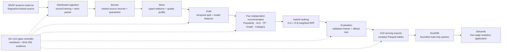

# Amazon Product Recommendation Using Spark

[](https://www.python.org/)
[](https://spark.apache.org/)
[](LICENSE)

**A gate-controlled recommendation platform that turns 548,552 Amazon product
records into auditable multi-model rankings and an interactive analytics
experience.**

This project is an end-to-end big-data recommendation system built around the
[Stanford SNAP Amazon product metadata dataset](https://snap.stanford.edu/data/amazon-meta.html).
It does more than train a single recommender: it parses a nearly 1 GiB irregular
text source with Apache Spark, builds source-faithful Bronze/Silver/Gold data
products, trains five complementary recommendation models, combines their
rankings through deterministic reciprocal rank fusion, evaluates them without
temporal leakage, and publishes the results to a four-page Streamlit application.

The result is a completed, reproducible system designed to make every important
claim traceable to data, configuration, tests, or a fingerprinted run artifact.

## Project Overview

The source dataset combines product metadata, directed similar-product
relationships, category hierarchies, and historical ratings in blank-line
delimited records. That format creates a harder engineering problem than loading
a conventional CSV: records are nested, some titles span physical lines,
discontinued products have a different shape, category labels can contain
brackets, and malformed blocks must be explained rather than silently discarded.

The pipeline turns that source into a recommendation experiment with three
goals:

- preserve raw evidence while producing typed, model-ready tables;
- compare structurally different recommenders under one leakage-safe protocol;
- make the resulting data quality, graph structure, rankings, and performance
  evidence explorable without starting Spark from the user interface.

Two review counts are deliberately kept distinct. Product headers report
`7.781.990` total reviews, while the downloaded source contains `7.593.244`
physical review rows. Models begin from the physical rows; the larger declared
count remains a data-quality signal rather than being substituted into the
interaction table.

## Technical Highlights

### Source-aware distributed ingestion

The ingestion layer detects the physical record delimiter, preserves byte
offsets and block-level SHA-256 hashes, and parses records with explicit Spark
schemas. Structurally invalid blocks are routed to quarantine with an error code,
raw evidence, and source location. Valid but unusual domain values remain in the
data with quality events, keeping structural failure separate from business-data
anomalies.

### Five complementary recommendation models

The system trains five independent candidate generators from the same
training-only evidence:

1. **Bayesian popularity** reduces the impact of small-sample rating averages.
2. **Explicit-feedback ALS** learns latent user and item factors from ratings.
3. **FP-Growth** turns sets of positively rated products into association rules.
4. **Graph recommendations** score one-hop, reciprocal, and two-hop paths in the
   directed product-similarity graph.
5. **Category recommendations** combine category-vector cosine similarity,
   user group affinity, and Bayesian popularity.

These models represent collaborative, associative, structural, content, and
baseline signals without forcing their incompatible raw score scales into one
numeric space.

### Deterministic hybrid rank fusion

The hybrid layer combines one-based model ranks using weighted reciprocal rank
fusion with `c = 60`. Only two approved configurations are materialized:

| Variant | ALS | Graph | Category | FP-Growth | Popularity |
|---|---:|---:|---:|---:|---:|
| H-A — balanced | 0.35 | 0.20 | 0.20 | 0.15 | 0.10 |
| H-B — behavior-weighted | 0.50 | 0.20 | 0.10 | 0.15 | 0.05 |

Weights are renormalized over the models that produced evidence for a user.
Final ordering uses hybrid score, contributing-model count, Bayesian score, and
product identifier as a deterministic tie-break chain. Contributions are folded
in canonical model order so distributed floating-point aggregation cannot change
top-K membership at ranking boundaries.

### Evidence-driven execution

The application is controlled by thirteen ordered gates. Every successful gate
produces a canonical JSON manifest containing the run identity, source and
configuration fingerprints, prerequisite evidence digests, output metadata, and
timing. A later gate cannot run against missing, failed, or fingerprint-mismatched
evidence.

Parquet tables are written to temporary directories, read back for verification,
and atomically renamed into place. Completed outputs can be reused after an
interruption, while incomplete temporary publications are removed without
touching successful work.

### Spark-free interactive serving

Spark performs expensive computation before the application starts. Streamlit
then reads completed run-scoped Parquet exports through an in-memory DuckDB
connection configured for two threads and a 384 MB memory limit. The presentation
layer accepts read-only queries, parameterizes user input, caps detail result
sizes, and serves only directories with Spark `_SUCCESS` markers.

This separation keeps the dashboard responsive and prevents a search, filter, or
page load from launching a new distributed job.

## System Architecture



### End-to-end flow

1. The raw file is fingerprinted, delimiter-framed, and parsed once into a
   resumable Bronze envelope.
2. Silver transformations normalize products, reviews, customers, category
   relations, graph edges, and data-quality events without overwriting raw facts.
3. User-product interactions are deduplicated and aggregated before a
   chronological train/validation/test split is created.
4. Five recommenders generate stage-aware candidates after excluding seen,
   discontinued, and out-of-catalog products.
5. H-A and H-B reuse the same frozen candidate evidence. The winner is selected
   from validation `common_warm` overall NDCG@10, then coverage, then the fixed
   H-A tie-break—before official test results are materialized.
6. Evaluation produces ranking, coverage, ALS prediction, runtime, and slice
   summaries; G10 derives compact dashboard-facing tables.
7. DuckDB and Streamlit expose the completed run, while G12 independently
   verifies the manifest chain and publishes the delivery bundle.

## Engineering Deep Dives

### 1. Parsing irregular metadata without losing evidence

The source is not treated as line-oriented CSV. The primary path uses Hadoop's
record delimiter support so large product blocks can cross normal split
boundaries and still be emitted exactly once. The fallback framer streams bytes
into 64 integrity-checked JSONL shards instead of loading the source into driver
memory.

Each parsed product retains its original source offset and block digest. The
parser understands active and discontinued record shapes, validates declared
list and review counts, preserves observed multiline titles, and handles category
segments by their terminal numeric identifiers. Failures become explicit
quarantine records rather than partially populated products.

The quality layer then reconciles source summaries with physical observations,
profiles duplicate reviews, tracks orphan graph targets, and emits a fixed
taxonomy of auditable events. This makes data cleaning inspectable and prevents
parser defects from being hidden inside aggregate model behavior.

### 2. Leakage-safe modeling and evaluation

Repeated physical reviews are removed before customer-product observations are
aggregated. For evaluation-eligible users, interactions are ordered by date and
product identifier: the penultimate interaction becomes validation, the latest
becomes test, and all earlier observations remain in training. The test seen-set
includes the validation item, but the model profile does not.

ALS receives a deterministic iterative k-core training universe. Popularity,
FP-Growth baskets, graph seeds, category profiles, and Bayesian tie scores are
all derived from training data only. Evaluation keeps users with empty
recommendation lists in the denominator, so coverage loss cannot be disguised as
ranking success.

Ranking quality is reported with NDCG@10, HitRate@10, and MRR@10. User coverage,
fill rate, and catalog coverage expose different failure modes, while RMSE and
MAE remain specific to raw, unclipped ALS predictions. The same frozen outputs
are also analyzed across overall, Book, and non-Book slices.

### 3. Reproducibility and interruption safety

`configs/project.yaml` locks source identity, random seed, Spark settings, split
rules, model parameters, candidate budgets, hybrid weights, evaluation metrics,
and the performance protocol. Configuration loading rejects changes to binding
values rather than silently creating a different experiment under the same run
identity.

Every table publication records row count, schema, file count, byte size, and
content fingerprint. Model and phase workspaces are signed by the implementation
and configuration, allowing completed stages to be reused only when their
contract matches. G12 recomputes prior manifest and artifact fingerprints,
reconstructs the frozen hybrid selection, verifies the official comparison
matrix, and writes the final success marker last.

### 4. Bounded analytics for a large local dataset

The dashboard never imports PySpark. A traversal-safe run catalog exposes only
allowlisted logical tables inside a selected immutable run directory. DuckDB
queries are SELECT-only, user search text is parameterized, and public reads have
hard row caps.

The four pages provide distinct views of the same evidence:

- **Catalog Observatory** — scale, distributions, sparsity, and quality events;
- **Product and Graph Explorer** — product metadata, taxonomy, PageRank, degree,
  weak component, and a bounded first-degree graph;
- **Recommendation Lab** — customer, seed-product, and category-onboarding
  recommendation exploration with evidence-based explanations;
- **Model and Experiment Comparison** — ranking metrics, coverage, ALS prediction
  metrics, model runtimes, local Spark performance, and reproducibility metadata.

NetworkX is restricted to deterministic layouts of at most 50 nodes; full graph
analytics remain distributed in GraphFrames and Spark SQL.

## Technology Stack

| Layer / Area | Technology | Role in the Project |
|---|---|---|
| Language and runtime | Python 3.13.1, Java 21.0.11, Scala 2.13.16 | Python application logic with the JVM/Scala runtime required by Spark |
| Distributed processing | Apache Spark 4.0.0, PySpark, Spark SQL | Parsing, transformation, feature engineering, candidate generation, and evaluation |
| Machine learning | Spark MLlib | Explicit-feedback ALS and FP-Growth training |
| Graph analytics | GraphFrames 0.12.1 | PageRank, degree, reciprocity, and weakly connected components |
| Analytical storage | Parquet, Snappy, PyArrow 25.0.0 | Typed, compressed, fingerprinted Bronze/Silver/Gold artifacts |
| Query layer | DuckDB 1.5.4 | Bounded read-only queries over completed Parquet exports |
| Application UI | Streamlit 1.59.1, Plotly 6.9.0 | Four-page interactive analytics and visualization |
| Local presentation helpers | pandas 2.3.0, NetworkX 3.5 | Bounded result shaping and small deterministic ego-graph layouts |
| Testing | pytest 9.1.1, pytest-cov 7.1.0 | Unit, Spark integration, contract, and delivery validation |
| Configuration and automation | YAML, JSON, Make, Bash | Immutable configuration, evidence manifests, repeatable commands, and environment enforcement |

## Gate-Controlled Pipeline

| Gate | Responsibility | Primary entry |
|---|---|---|
| G0 | Runtime, Spark, GraphFrames, Parquet, and checkpoint proof | `scripts/g0_smoke.py` |
| G1 | Passing JUnit evidence and project command contract | `gate G1` |
| G2 | Parser and record-boundary contract | `gate G2` |
| G3 | Deterministic Bronze-to-Gold smoke pipeline | `gate G3` |
| G4 | Full-source ETL and canonical source counts | `gate G4` |
| G5 | Deduplication, interaction aggregation, and quality profile | `gate G5` |
| G6 | Temporal split, cohorts, k-core, and leakage checks | `gate G6` |
| G7 | Five independent model outputs | `gate G7` |
| G8 | Shared hybrid evidence and H-A/H-B rankings | `gate G8` |
| G9 | Validation freeze and official evaluation | `gate G9` |
| G10 | Spark-free dashboard exports and application contracts | `gate G10` |
| G11 | Controlled `local[1]` versus bounded multi-core experiment | `gate G11` |
| G12 | Independent acceptance audit and atomic delivery | `gate G12` |

## Project Structure

```text
.
├── app/                         # Streamlit pages and bounded DuckDB access
├── bin/amazon-rec               # Environment-enforcing command launcher
├── configs/project.yaml         # Source, Spark, model, and experiment contract
├── scripts/                     # Dataset analysis, G0 proof, and sharded tests
├── src/amazon_recommender/
│   ├── core/                    # Configuration, gates, manifests, paths, logging
│   ├── ingestion/               # Delimiter framing, schemas, and strict parser
│   ├── pipelines/               # Bronze/Silver/Gold transforms and atomic storage
│   ├── quality/                 # Data profiling and quality-event taxonomy
│   ├── features/                # Temporal split, cohorts, baskets, and profiles
│   ├── models/                  # Five recommenders and hybrid rank fusion
│   ├── evaluation/              # Ranking, coverage, and ALS prediction metrics
│   ├── performance/             # Fixed workload and Spark event-log analysis
│   └── phases/                  # G2–G12 gate implementations
└── tests/                       # Unit and local Spark integration contracts
```

## Running the Project

### Prerequisites

- Linux with `pyenv` and the `pyenv-virtualenv` plugin;
- Python `3.13.1` in an environment named `bil401_env_1`;
- OpenJDK `21.0.11` at `/usr/lib/jvm/java-21-openjdk-amd64`;
- at least 20 GiB of free disk for source data, Parquet outputs, models, and
  atomic publication workspaces;
- the SNAP source at `Dataset/amazon-meta.txt` with SHA-256
  `600135116a05b7ce2dcb7e842e892d663c6190a0567d00373e0c5c4f3c908f02`.

The dataset and generated run artifacts are intentionally kept outside version
control.

### 1. Create the locked Python environment

```bash
pyenv install -s 3.13.1
pyenv prefix bil401_env_1 >/dev/null 2>&1 || \
  pyenv virtualenv 3.13.1 bil401_env_1

export PYENV_VERSION=bil401_env_1
export PY="$(pyenv which python)"
export JAVA_HOME=/usr/lib/jvm/java-21-openjdk-amd64

"$PY" -m pip install -r requirements.lock -e .
```

### 2. Cache the GraphFrames runtime JARs

```bash
mkdir -p .cache/ivy/jars

PYSPARK_PYTHON="$PY" \
PYSPARK_DRIVER_PYTHON="$PY" \
PYSPARK_SUBMIT_ARGS='--packages io.graphframes:graphframes-spark4_2.13:0.12.1 pyspark-shell' \
"$PY" -c 'from pyspark.sql import SparkSession; SparkSession.builder.getOrCreate().stop()'

find "$HOME/.ivy2/jars" -maxdepth 1 -type f \
  \( -name 'io.graphframes_*.jar' -o -name 'org.apache.datasketches_*.jar' \) \
  -exec cp -n {} .cache/ivy/jars/ \;
```

### 3. Create test evidence and a run identity

```bash
export SOURCE8="$(sha256sum Dataset/amazon-meta.txt | cut -c1-8)"
export RUN_ID="run-$(date -u +%Y%m%dT%H%M%SZ)-$SOURCE8"
export JUNIT="artifacts/runs/$RUN_ID/test-results/preflight.xml"

make test \
  RUN_ID="$RUN_ID" \
  TEST_JUNIT="$JUNIT" \
  TEST_SHARD_DIR="artifacts/runs/$RUN_ID/test-results/shards"
```

The sharded runner executes Spark-heavy test groups in separate processes,
merges their JUnit files, and refuses to start beside another active project
Spark process.

### 4. Establish G0 environment evidence

```bash
export JARS="$(find .cache/ivy/jars -type f -name '*.jar' | sort | paste -sd, -)"
export PYSPARK_SUBMIT_ARGS="--master local[2] --driver-memory 2g \
  --conf spark.ui.enabled=false --jars $JARS pyspark-shell"

JAVA_HOME="$JAVA_HOME" \
PYSPARK_PYTHON="$PY" \
PYSPARK_DRIVER_PYTHON="$PY" \
"$PY" scripts/g0_smoke.py \
  --output "artifacts/runs/$RUN_ID/manifests/G0.json"
```

### 5. Run the ordered pipeline

```bash
for gate_number in {1..12}; do
  ./bin/amazon-rec \
    --run-id "$RUN_ID" \
    gate "G${gate_number}" \
    --evidence-file "$JUNIT" || exit 1
done
```

Inspect the chain at any time:

```bash
./bin/amazon-rec --run-id "$RUN_ID" status
```

### 6. Open the dashboard

```bash
STREAMLIT_SERVER_HEADLESS=true \
STREAMLIT_SERVER_ADDRESS=127.0.0.1 \
STREAMLIT_SERVER_PORT=8501 \
STREAMLIT_BROWSER_GATHER_USAGE_STATS=false \
./bin/amazon-rec --run-id "$RUN_ID" dashboard
```

The application is then available at `http://127.0.0.1:8501`.

## Quality and Verification

The repository's pytest collection discovers **184 test cases** across unit and
local Spark integration suites. The suite covers:

- CRLF/LF framing, oversized Hadoop records, parser quarantine, and explicit
  schemas;
- deterministic cleaning, temporal splitting, leakage prevention, and stable
  sampling;
- hand-calculated Bayesian, association-rule, graph, category, RRF, and
  ranking-metric examples;
- candidate filtering, fixed model parameters, stable tie-breaking, and hybrid
  budget enforcement;
- interruption-safe Parquet publication and run-path traversal protection;
- parameterized DuckDB search, bounded NetworkX layouts, and proof that the
  Streamlit application does not import PySpark;
- G9 selection freezing, G11 trial reconciliation, G12 fingerprint verification,
  and final delivery publication.

Official outputs remain machine-readable:

- manifests: `artifacts/runs/$RUN_ID/manifests/G0.json` through `G12.json`;
- model comparison:
  `artifacts/runs/$RUN_ID/data/g9/official_test_comparison/`;
- selection evidence:
  `artifacts/runs/$RUN_ID/data/g9/selected_hybrid/`;
- performance evidence: `artifacts/runs/$RUN_ID/performance/summary.json`;
- accepted delivery: `artifacts/runs/$RUN_ID/delivery/`.

These artifacts allow a reviewer to distinguish configuration, measured output,
and presentation text instead of relying on manually copied metrics.

## License

The source code is available under the [MIT License](LICENSE). The SNAP dataset
retains its own source and citation terms.

This project demonstrates an end-to-end approach to data-intensive recommendation
engineering: distributed ingestion, explicit data contracts, complementary model
families, deterministic ranking, reproducible evaluation, failure-aware artifact
publication, and a carefully bounded analytical user experience.
